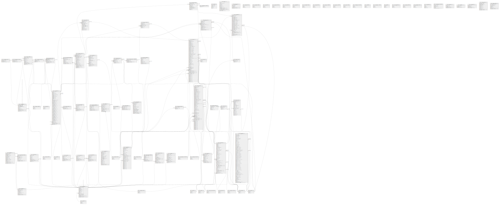

# EC-CUBE 2.17.x table definition

## Description

EC-CUBE 2.17.x テーブル定義書

## Tables

| Name | Columns | Comment | Type |
| ---- | ------- | ------- | ---- |
| [public.dtb_module_update_logs](public.dtb_module_update_logs.md) | 8 | モジュール更新ログ情報 | BASE TABLE |
| [public.dtb_ownersstore_settings](public.dtb_ownersstore_settings.md) | 1 | オーナーズストア設定 | BASE TABLE |
| [public.dtb_kiyaku](public.dtb_kiyaku.md) | 8 | 規約情報 | BASE TABLE |
| [public.dtb_holiday](public.dtb_holiday.md) | 9 | 休日情報 | BASE TABLE |
| [public.mtb_zip](public.mtb_zip.md) | 5 | 郵便番号 | BASE TABLE |
| [public.dtb_update](public.dtb_update.md) | 14 | モジュール更新情報 | BASE TABLE |
| [public.dtb_baseinfo](public.dtb_baseinfo.md) | 66 | 店舗基本情報 | BASE TABLE |
| [public.dtb_deliv](public.dtb_deliv.md) | 12 | 配送業者情報 | BASE TABLE |
| [public.dtb_payment_options](public.dtb_payment_options.md) | 3 | 支払選択肢情報 | BASE TABLE |
| [public.dtb_delivtime](public.dtb_delivtime.md) | 3 | 配送時間情報 | BASE TABLE |
| [public.dtb_delivfee](public.dtb_delivfee.md) | 4 | 送料情報 | BASE TABLE |
| [public.dtb_payment](public.dtb_payment.md) | 29 | 支払方法情報 | BASE TABLE |
| [public.dtb_mailtemplate](public.dtb_mailtemplate.md) | 8 | メールテンプレート情報 | BASE TABLE |
| [public.dtb_mailmaga_template](public.dtb_mailmaga_template.md) | 8 | メルマガテンプレート情報 | BASE TABLE |
| [public.dtb_send_history](public.dtb_send_history.md) | 13 | メール送信履歴 | BASE TABLE |
| [public.dtb_send_customer](public.dtb_send_customer.md) | 5 | 顧客メール送信履歴 | BASE TABLE |
| [public.dtb_products](public.dtb_products.md) | 45 | 商品情報 | BASE TABLE |
| [public.dtb_products_class](public.dtb_products_class.md) | 19 | 商品規格情報 | BASE TABLE |
| [public.dtb_class](public.dtb_class.md) | 7 | 規格情報 | BASE TABLE |
| [public.dtb_classcategory](public.dtb_classcategory.md) | 8 | 規格分類情報 | BASE TABLE |
| [public.dtb_category](public.dtb_category.md) | 9 | カテゴリ情報 | BASE TABLE |
| [public.dtb_product_categories](public.dtb_product_categories.md) | 3 | 商品カテゴリ関連 | BASE TABLE |
| [public.dtb_product_status](public.dtb_product_status.md) | 6 | 商品ステータス情報 | BASE TABLE |
| [public.dtb_recommend_products](public.dtb_recommend_products.md) | 8 | 関連商品情報 | BASE TABLE |
| [public.dtb_review](public.dtb_review.md) | 14 | レビュー情報 | BASE TABLE |
| [public.dtb_customer_favorite_products](public.dtb_customer_favorite_products.md) | 4 | お気に入り商品情報 | BASE TABLE |
| [public.dtb_category_count](public.dtb_category_count.md) | 3 | カテゴリ商品数情報 | BASE TABLE |
| [public.dtb_category_total_count](public.dtb_category_total_count.md) | 3 | カテゴリ商品合計数情報 | BASE TABLE |
| [public.dtb_news](public.dtb_news.md) | 12 | 新着情報 | BASE TABLE |
| [public.dtb_best_products](public.dtb_best_products.md) | 10 | おすすめ商品情報 | BASE TABLE |
| [public.dtb_mail_history](public.dtb_mail_history.md) | 7 | 受注メール送信履歴 | BASE TABLE |
| [public.dtb_customer](public.dtb_customer.md) | 41 | 顧客情報 | BASE TABLE |
| [public.dtb_order](public.dtb_order.md) | 57 | 受注情報 | BASE TABLE |
| [public.dtb_order_temp](public.dtb_order_temp.md) | 59 | 受注一時情報 | BASE TABLE |
| [public.dtb_shipping](public.dtb_shipping.md) | 28 | 配送先情報 | BASE TABLE |
| [public.dtb_shipment_item](public.dtb_shipment_item.md) | 9 | 配送商品情報 | BASE TABLE |
| [public.dtb_other_deliv](public.dtb_other_deliv.md) | 20 | その他の配送先情報 | BASE TABLE |
| [public.dtb_order_detail](public.dtb_order_detail.md) | 13 | 受注詳細情報 | BASE TABLE |
| [public.dtb_member](public.dtb_member.md) | 14 | 管理画面メンバー情報 | BASE TABLE |
| [public.dtb_pagelayout](public.dtb_pagelayout.md) | 15 | ページレイアウト情報 | BASE TABLE |
| [public.dtb_bloc](public.dtb_bloc.md) | 10 | ブロック情報 | BASE TABLE |
| [public.dtb_blocposition](public.dtb_blocposition.md) | 6 | ブロック配置情報 | BASE TABLE |
| [public.dtb_csv](public.dtb_csv.md) | 12 | CSV情報 | BASE TABLE |
| [public.dtb_csv_sql](public.dtb_csv_sql.md) | 5 | CSV詳細設定SQL情報 | BASE TABLE |
| [public.dtb_templates](public.dtb_templates.md) | 5 | テンプレート情報 | BASE TABLE |
| [public.dtb_maker](public.dtb_maker.md) | 7 | メーカー | BASE TABLE |
| [public.dtb_maker_count](public.dtb_maker_count.md) | 3 | メーカーカウント | BASE TABLE |
| [public.mtb_pref](public.mtb_pref.md) | 3 | 都道府県マスタ | BASE TABLE |
| [public.mtb_permission](public.mtb_permission.md) | 3 | 管理画面アクセス権限 | BASE TABLE |
| [public.mtb_disable_logout](public.mtb_disable_logout.md) | 3 | ログアウト無効ページ | BASE TABLE |
| [public.mtb_authority](public.mtb_authority.md) | 3 | 管理者マスタ | BASE TABLE |
| [public.mtb_auth_excludes](public.mtb_auth_excludes.md) | 3 | 管理画面認証除外 | BASE TABLE |
| [public.mtb_work](public.mtb_work.md) | 3 | 稼動状態 | BASE TABLE |
| [public.mtb_disp](public.mtb_disp.md) | 3 | 公開フラグ | BASE TABLE |
| [public.mtb_status](public.mtb_status.md) | 3 | 商品ステータス | BASE TABLE |
| [public.mtb_status_image](public.mtb_status_image.md) | 3 | ステータス画像 | BASE TABLE |
| [public.mtb_allowed_tag](public.mtb_allowed_tag.md) | 3 | 許可タグ | BASE TABLE |
| [public.mtb_page_max](public.mtb_page_max.md) | 3 | ページ最大表示数 | BASE TABLE |
| [public.mtb_magazine_type](public.mtb_magazine_type.md) | 3 | メルマガ種別 | BASE TABLE |
| [public.mtb_mail_magazine_type](public.mtb_mail_magazine_type.md) | 3 | メールマガジン種別 | BASE TABLE |
| [public.mtb_recommend](public.mtb_recommend.md) | 3 | おすすめレベル | BASE TABLE |
| [public.mtb_taxrule](public.mtb_taxrule.md) | 3 | 課税規則マスタ | BASE TABLE |
| [public.mtb_mail_template](public.mtb_mail_template.md) | 3 | メールテンプレート | BASE TABLE |
| [public.mtb_mail_tpl_path](public.mtb_mail_tpl_path.md) | 3 | メールテンプレートパス | BASE TABLE |
| [public.mtb_job](public.mtb_job.md) | 3 | 職業マスタ | BASE TABLE |
| [public.mtb_reminder](public.mtb_reminder.md) | 3 | パスワード質問マスタ | BASE TABLE |
| [public.mtb_sex](public.mtb_sex.md) | 3 | 性別マスタ | BASE TABLE |
| [public.mtb_customer_status](public.mtb_customer_status.md) | 3 | 顧客ステータス | BASE TABLE |
| [public.mtb_mail_type](public.mtb_mail_type.md) | 3 | メール種別 | BASE TABLE |
| [public.mtb_order_status](public.mtb_order_status.md) | 3 | 受注状態 | BASE TABLE |
| [public.mtb_product_status_color](public.mtb_product_status_color.md) | 3 | 商品ステータス色 | BASE TABLE |
| [public.mtb_customer_order_status](public.mtb_customer_order_status.md) | 3 | 顧客表示用受注ステータス | BASE TABLE |
| [public.mtb_order_status_color](public.mtb_order_status_color.md) | 3 | 受注ステータス色 | BASE TABLE |
| [public.mtb_wday](public.mtb_wday.md) | 3 | 曜日 | BASE TABLE |
| [public.mtb_delivery_date](public.mtb_delivery_date.md) | 3 | 商品発送日 | BASE TABLE |
| [public.mtb_product_list_max](public.mtb_product_list_max.md) | 3 | 商品一覧最大表示数 | BASE TABLE |
| [public.mtb_db](public.mtb_db.md) | 3 | データベース種別 | BASE TABLE |
| [public.mtb_target](public.mtb_target.md) | 3 | ブロックターゲット | BASE TABLE |
| [public.mtb_review_deny_url](public.mtb_review_deny_url.md) | 3 | レビュー拒否URL | BASE TABLE |
| [public.mtb_mobile_domain](public.mtb_mobile_domain.md) | 3 | モバイルドメイン名 | BASE TABLE |
| [public.mtb_ownersstore_err](public.mtb_ownersstore_err.md) | 3 | オーナーズストアエラー種別 | BASE TABLE |
| [public.mtb_constants](public.mtb_constants.md) | 4 | 定数マスタ | BASE TABLE |
| [public.mtb_product_type](public.mtb_product_type.md) | 3 | 商品種別マスタ | BASE TABLE |
| [public.mtb_device_type](public.mtb_device_type.md) | 3 | 端末種別 | BASE TABLE |
| [public.mtb_country](public.mtb_country.md) | 3 | 【2.13】国マスタ | BASE TABLE |
| [public.dtb_mobile_ext_session_id](public.dtb_mobile_ext_session_id.md) | 5 | モバイルセッション情報 | BASE TABLE |
| [public.dtb_module](public.dtb_module.md) | 8 | モジュール情報 | BASE TABLE |
| [public.dtb_session](public.dtb_session.md) | 4 | セッション情報 | BASE TABLE |
| [public.dtb_bkup](public.dtb_bkup.md) | 3 | バックアップ | BASE TABLE |
| [public.dtb_plugin](public.dtb_plugin.md) | 18 | プラグイン情報 | BASE TABLE |
| [public.dtb_plugin_hookpoint](public.dtb_plugin_hookpoint.md) | 7 | プラグインフックポイント | BASE TABLE |
| [public.dtb_index_list](public.dtb_index_list.md) | 4 | インデックス一覧 | BASE TABLE |
| [public.dtb_api_config](public.dtb_api_config.md) | 10 | API設定 | BASE TABLE |
| [public.dtb_api_account](public.dtb_api_account.md) | 7 | APIアカウント | BASE TABLE |
| [public.dtb_tax_rule](public.dtb_tax_rule.md) | 13 | 【2.13】消費税ルール | BASE TABLE |

## Relations

---

> Generated by [tbls](https://github.com/k1LoW/tbls)
