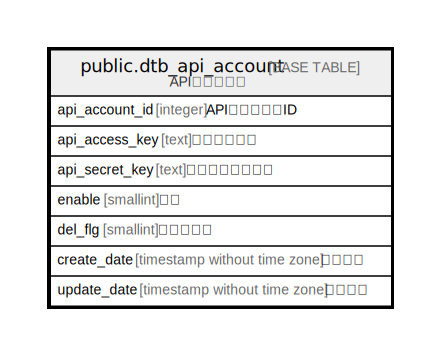

# public.dtb_api_account

## Description

APIアカウント

## Columns

| Name | Type | Default | Nullable | Children | Parents | Comment |
| ---- | ---- | ------- | -------- | -------- | ------- | ------- |
| api_account_id | integer |  | false |  |  | APIアカウントID |
| api_access_key | text |  | false |  |  | アクセスキー |
| api_secret_key | text |  | false |  |  | シークレットキー |
| enable | smallint | 0 | false |  |  | 有効 |
| del_flg | smallint | 0 | false |  |  | 削除フラグ |
| create_date | timestamp without time zone | CURRENT_TIMESTAMP | false |  |  | 作成日時 |
| update_date | timestamp without time zone |  | false |  |  | 更新日時 |

## Constraints

| Name | Type | Definition |
| ---- | ---- | ---------- |
| dtb_api_account_pkey | PRIMARY KEY | PRIMARY KEY (api_account_id) |

## Indexes

| Name | Definition |
| ---- | ---------- |
| dtb_api_account_pkey | CREATE UNIQUE INDEX dtb_api_account_pkey ON public.dtb_api_account USING btree (api_account_id) |

## Relations

---

> Generated by [tbls](https://github.com/k1LoW/tbls)
