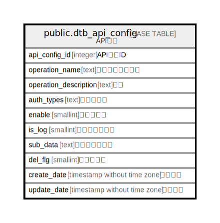

# public.dtb_api_config

## Description

API設定

## Columns

| Name | Type | Default | Nullable | Children | Parents | Comment |
| ---- | ---- | ------- | -------- | -------- | ------- | ------- |
| api_config_id | integer |  | false |  |  | API設定ID |
| operation_name | text |  | false |  |  | オペレーション名 |
| operation_description | text |  | true |  |  | 説明 |
| auth_types | text |  | false |  |  | 認証タイプ |
| enable | smallint | 0 | false |  |  | 有効フラグ |
| is_log | smallint | 0 | false |  |  | ログ出力フラグ |
| sub_data | text |  | true |  |  | 追加の設定情報 |
| del_flg | smallint | 0 | false |  |  | 削除フラグ |
| create_date | timestamp without time zone | CURRENT_TIMESTAMP | false |  |  | 作成日時 |
| update_date | timestamp without time zone |  | false |  |  | 更新日時 |

## Constraints

| Name | Type | Definition |
| ---- | ---- | ---------- |
| dtb_api_config_pkey | PRIMARY KEY | PRIMARY KEY (api_config_id) |

## Indexes

| Name | Definition |
| ---- | ---------- |
| dtb_api_config_pkey | CREATE UNIQUE INDEX dtb_api_config_pkey ON public.dtb_api_config USING btree (api_config_id) |

## Relations

---

> Generated by [tbls](https://github.com/k1LoW/tbls)
