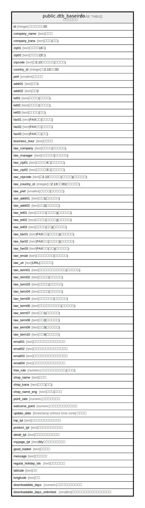

# public.dtb_baseinfo

## Description

店舗基本情報

## Columns

| Name | Type | Default | Nullable | Children | Parents | Comment |
| ---- | ---- | ------- | -------- | -------- | ------- | ------- |
| id | integer |  | false |  |  | 店舗基本情報ID |
| company_name | text |  | true |  |  | 会社名 |
| company_kana | text |  | true |  |  | 会社名(カナ) |
| zip01 | text |  | true |  |  | 郵便番号(4桁) |
| zip02 | text |  | true |  |  | 郵便番号(3桁) |
| zipcode | text |  | true |  |  | 【2.13】郵便番号(海外対応) |
| country_id | integer |  | true |  | [public.mtb_country](public.mtb_country.md) | 【2.13】国ID |
| pref | smallint |  | true |  | [public.mtb_pref](public.mtb_pref.md) | 都道府県 |
| addr01 | text |  | true |  |  | 住所1 |
| addr02 | text |  | true |  |  | 住所2 |
| tel01 | text |  | true |  |  | 電話番号(市外局番) |
| tel02 | text |  | true |  |  | 電話番号(市内局番) |
| tel03 | text |  | true |  |  | 電話番号(局番) |
| fax01 | text |  | true |  |  | FAX番号(市外局番) |
| fax02 | text |  | true |  |  | FAX番号(市内局番) |
| fax03 | text |  | true |  |  | FAX番号(局番) |
| business_hour | text |  | true |  |  | 営業時間 |
| law_company | text |  | true |  |  | 販売業者(特定商取引) |
| law_manager | text |  | true |  |  | 販売責任者(特定商取引) |
| law_zip01 | text |  | true |  |  | 郵便番号4桁(特定商取引) |
| law_zip02 | text |  | true |  |  | 郵便番号3桁(特定商取引) |
| law_zipcode | text |  | true |  |  | 【2.13】郵便番号(海外対応)(特定商取引) |
| law_country_id | integer |  | true |  | [public.mtb_country](public.mtb_country.md) | 【2.13】国ID(特定商取引) |
| law_pref | smallint |  | true |  |  | 都道府県(特定商取引) |
| law_addr01 | text |  | true |  |  | 住所1(特定商取引) |
| law_addr02 | text |  | true |  |  | 住所2(特定商取引) |
| law_tel01 | text |  | true |  |  | 電話番号(市外局番)(特定商取引) |
| law_tel02 | text |  | true |  |  | 電話番号(市内局番)(特定商取引) |
| law_tel03 | text |  | true |  |  | 電話番号(局番)(特定商取引) |
| law_fax01 | text |  | true |  |  | FAX番号(市外局番)(特定商取引) |
| law_fax02 | text |  | true |  |  | FAX番号(市内局番)(特定商取引) |
| law_fax03 | text |  | true |  |  | FAX番号(局番)(特定商取引) |
| law_email | text |  | true |  |  | メールアドレス(特定商取引) |
| law_url | text |  | true |  |  | URL(特定商取引) |
| law_term01 | text |  | true |  |  | 商品代金以外の必要料金(特定商取引) |
| law_term02 | text |  | true |  |  | 注文方法(特定商取引) |
| law_term03 | text |  | true |  |  | 支払方法(特定商取引) |
| law_term04 | text |  | true |  |  | 支払期限(特定商取引) |
| law_term05 | text |  | true |  |  | 引き渡し時期(特定商取引) |
| law_term06 | text |  | true |  |  | 返品・交換について(特定商取引) |
| law_term07 | text |  | true |  |  | 予備1(特定商取引) |
| law_term08 | text |  | true |  |  | 予備2(特定商取引) |
| law_term09 | text |  | true |  |  | 予備3(特定商取引) |
| law_term10 | text |  | true |  |  | 予備4(特定商取引) |
| email01 | text |  | true |  |  | 受注情報受付メールアドレス |
| email02 | text |  | true |  |  | 問い合わせ受付メールアドレス |
| email03 | text |  | true |  |  | 送信エラー受付メールアドレス |
| email04 | text |  | true |  |  | メール送信元メールアドレス |
| free_rule | numeric |  | true |  |  | 送料・手数料無料条件(円以上) |
| shop_name | text |  | true |  |  | 店舗名 |
| shop_kana | text |  | true |  |  | 店舗名(カナ) |
| shop_name_eng | text |  | true |  |  | 店舗名(英語） |
| point_rate | numeric | 0 | false |  |  | ポイント付与率 |
| welcome_point | numeric | 0 | false |  |  | 会員登録時付与ポイント |
| update_date | timestamp without time zone |  | false |  |  | 更新日時 |
| top_tpl | text |  | true |  |  | トップページテンプレート |
| product_tpl | text |  | true |  |  | 商品一覧テンプレート |
| detail_tpl | text |  | true |  |  | 商品詳細テンプレート |
| mypage_tpl | text |  | true |  |  | Myページテンプレート |
| good_traded | text |  | true |  |  | 取扱商品 |
| message | text |  | true |  |  | メッセージ |
| regular_holiday_ids | text |  | true |  |  | 定休日の曜日 |
| latitude | text |  | true |  |  | 緯度 |
| longitude | text |  | true |  |  | 経度 |
| downloadable_days | numeric | 30 | true |  |  | ダウンロード可能日数 |
| downloadable_days_unlimited | smallint |  | true |  |  | ダウンロード可能日数無制限フラグ |

## Constraints

| Name | Type | Definition |
| ---- | ---- | ---------- |
| dtb_baseinfo_pkey | PRIMARY KEY | PRIMARY KEY (id) |

## Indexes

| Name | Definition |
| ---- | ---------- |
| dtb_baseinfo_pkey | CREATE UNIQUE INDEX dtb_baseinfo_pkey ON public.dtb_baseinfo USING btree (id) |

## Relations

---

> Generated by [tbls](https://github.com/k1LoW/tbls)
