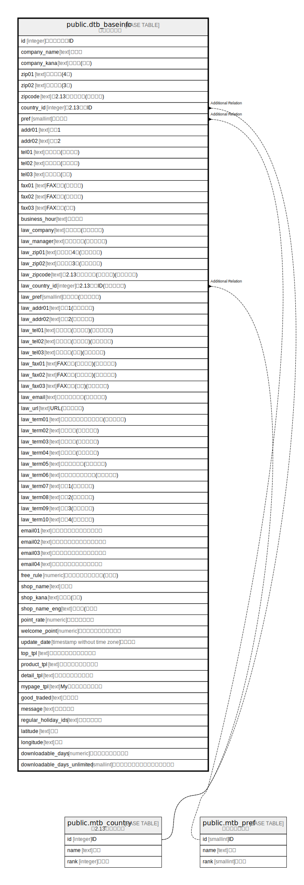

# public.dtb_baseinfo

## Description

## Columns

| Name | Type | Default | Nullable | Children | Parents | Comment |
| ---- | ---- | ------- | -------- | -------- | ------- | ------- |
| id | integer |  | false |  |  |  |
| company_name | text |  | true |  |  |  |
| company_kana | text |  | true |  |  |  |
| zip01 | text |  | true |  |  |  |
| zip02 | text |  | true |  |  |  |
| zipcode | text |  | true |  |  |  |
| country_id | integer |  | true |  |  |  |
| pref | smallint |  | true |  |  |  |
| addr01 | text |  | true |  |  |  |
| addr02 | text |  | true |  |  |  |
| tel01 | text |  | true |  |  |  |
| tel02 | text |  | true |  |  |  |
| tel03 | text |  | true |  |  |  |
| fax01 | text |  | true |  |  |  |
| fax02 | text |  | true |  |  |  |
| fax03 | text |  | true |  |  |  |
| business_hour | text |  | true |  |  |  |
| law_company | text |  | true |  |  |  |
| law_manager | text |  | true |  |  |  |
| law_zip01 | text |  | true |  |  |  |
| law_zip02 | text |  | true |  |  |  |
| law_zipcode | text |  | true |  |  |  |
| law_country_id | integer |  | true |  |  |  |
| law_pref | smallint |  | true |  |  |  |
| law_addr01 | text |  | true |  |  |  |
| law_addr02 | text |  | true |  |  |  |
| law_tel01 | text |  | true |  |  |  |
| law_tel02 | text |  | true |  |  |  |
| law_tel03 | text |  | true |  |  |  |
| law_fax01 | text |  | true |  |  |  |
| law_fax02 | text |  | true |  |  |  |
| law_fax03 | text |  | true |  |  |  |
| law_email | text |  | true |  |  |  |
| law_url | text |  | true |  |  |  |
| law_term01 | text |  | true |  |  |  |
| law_term02 | text |  | true |  |  |  |
| law_term03 | text |  | true |  |  |  |
| law_term04 | text |  | true |  |  |  |
| law_term05 | text |  | true |  |  |  |
| law_term06 | text |  | true |  |  |  |
| law_term07 | text |  | true |  |  |  |
| law_term08 | text |  | true |  |  |  |
| law_term09 | text |  | true |  |  |  |
| law_term10 | text |  | true |  |  |  |
| email01 | text |  | true |  |  |  |
| email02 | text |  | true |  |  |  |
| email03 | text |  | true |  |  |  |
| email04 | text |  | true |  |  |  |
| free_rule | numeric |  | true |  |  |  |
| shop_name | text |  | true |  |  |  |
| shop_kana | text |  | true |  |  |  |
| shop_name_eng | text |  | true |  |  |  |
| point_rate | numeric | 0 | false |  |  |  |
| welcome_point | numeric | 0 | false |  |  |  |
| update_date | timestamp without time zone |  | false |  |  |  |
| top_tpl | text |  | true |  |  |  |
| product_tpl | text |  | true |  |  |  |
| detail_tpl | text |  | true |  |  |  |
| mypage_tpl | text |  | true |  |  |  |
| good_traded | text |  | true |  |  |  |
| message | text |  | true |  |  |  |
| regular_holiday_ids | text |  | true |  |  |  |
| latitude | text |  | true |  |  |  |
| longitude | text |  | true |  |  |  |
| downloadable_days | numeric | 30 | true |  |  |  |
| downloadable_days_unlimited | smallint |  | true |  |  |  |

## Constraints

| Name | Type | Definition |
| ---- | ---- | ---------- |
| dtb_baseinfo_pkey | PRIMARY KEY | PRIMARY KEY (id) |

## Indexes

| Name | Definition |
| ---- | ---------- |
| dtb_baseinfo_pkey | CREATE UNIQUE INDEX dtb_baseinfo_pkey ON public.dtb_baseinfo USING btree (id) |

## Relations

---

> Generated by [tbls](https://github.com/k1LoW/tbls)
