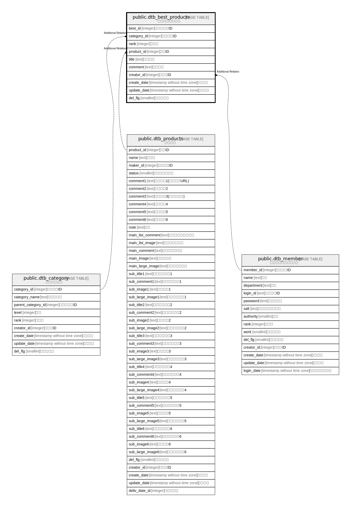

# public.dtb_best_products

## Description

おすすめ商品情報

## Columns

| Name | Type | Default | Nullable | Children | Parents | Comment |
| ---- | ---- | ------- | -------- | -------- | ------- | ------- |
| best_id | integer |  | false |  |  | ベスト商品ID |
| category_id | integer |  | false |  | [public.dtb_category](public.dtb_category.md) | カテゴリID |
| rank | integer | 0 | false |  |  | 表示順 |
| product_id | integer |  | false |  | [public.dtb_products](public.dtb_products.md) | 商品ID |
| title | text |  | true |  |  | タイトル |
| comment | text |  | true |  |  | コメント |
| creator_id | integer |  | false |  | [public.dtb_member](public.dtb_member.md) | 作成者ID |
| create_date | timestamp without time zone | CURRENT_TIMESTAMP | false |  |  | 作成日時 |
| update_date | timestamp without time zone |  | false |  |  | 更新日時 |
| del_flg | smallint | 0 | false |  |  | 削除フラグ |

## Constraints

| Name | Type | Definition |
| ---- | ---- | ---------- |
| dtb_best_products_pkey | PRIMARY KEY | PRIMARY KEY (best_id) |

## Indexes

| Name | Definition |
| ---- | ---------- |
| dtb_best_products_pkey | CREATE UNIQUE INDEX dtb_best_products_pkey ON public.dtb_best_products USING btree (best_id) |

## Relations

---

> Generated by [tbls](https://github.com/k1LoW/tbls)
