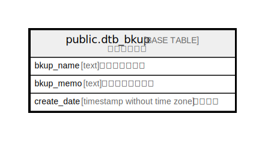

# public.dtb_bkup

## Description

## Columns

| Name | Type | Default | Nullable | Children | Parents | Comment |
| ---- | ---- | ------- | -------- | -------- | ------- | ------- |
| bkup_name | text |  | false |  |  |  |
| bkup_memo | text |  | true |  |  |  |
| create_date | timestamp without time zone | CURRENT_TIMESTAMP | false |  |  |  |

## Constraints

| Name | Type | Definition |
| ---- | ---- | ---------- |
| dtb_bkup_pkey | PRIMARY KEY | PRIMARY KEY (bkup_name) |

## Indexes

| Name | Definition |
| ---- | ---------- |
| dtb_bkup_pkey | CREATE UNIQUE INDEX dtb_bkup_pkey ON public.dtb_bkup USING btree (bkup_name) |

## Relations

---

> Generated by [tbls](https://github.com/k1LoW/tbls)
