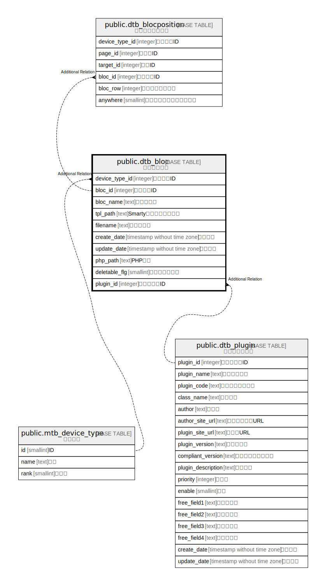

# public.dtb_bloc

## Description

ブロック情報

## Columns

| Name | Type | Default | Nullable | Children | Parents | Comment |
| ---- | ---- | ------- | -------- | -------- | ------- | ------- |
| device_type_id | integer |  | false |  | [public.mtb_device_type](public.mtb_device_type.md) | 端末種別ID |
| bloc_id | integer |  | false | [public.dtb_blocposition](public.dtb_blocposition.md) |  | ブロックID |
| bloc_name | text |  | true |  |  | ブロック名 |
| tpl_path | text |  | true |  |  | Smartyテンプレートパス |
| filename | text |  | false |  |  | ファイル名 |
| create_date | timestamp without time zone | CURRENT_TIMESTAMP | false |  |  | 作成日時 |
| update_date | timestamp without time zone |  | false |  |  | 更新日時 |
| php_path | text |  | true |  |  | PHPパス |
| deletable_flg | smallint | 1 | false |  |  | 削除可能フラグ |
| plugin_id | integer |  | true |  | [public.dtb_plugin](public.dtb_plugin.md) | プラグインID |

## Constraints

| Name | Type | Definition |
| ---- | ---- | ---------- |
| dtb_bloc_pkey | PRIMARY KEY | PRIMARY KEY (device_type_id, bloc_id) |
| dtb_bloc_device_type_id_filename_key | UNIQUE | UNIQUE (device_type_id, filename) |

## Indexes

| Name | Definition |
| ---- | ---------- |
| dtb_bloc_pkey | CREATE UNIQUE INDEX dtb_bloc_pkey ON public.dtb_bloc USING btree (device_type_id, bloc_id) |
| dtb_bloc_device_type_id_filename_key | CREATE UNIQUE INDEX dtb_bloc_device_type_id_filename_key ON public.dtb_bloc USING btree (device_type_id, filename) |

## Relations

---

> Generated by [tbls](https://github.com/k1LoW/tbls)
