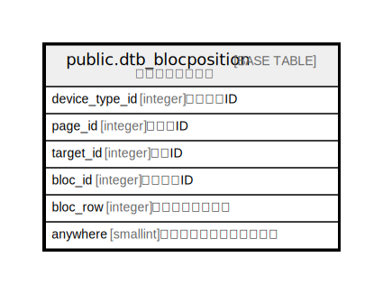

# public.dtb_blocposition

## Description

ブロック配置情報

## Columns

| Name | Type | Default | Nullable | Children | Parents | Comment |
| ---- | ---- | ------- | -------- | -------- | ------- | ------- |
| device_type_id | integer |  | false |  | [public.mtb_device_type](public.mtb_device_type.md) | 端末種別ID |
| page_id | integer |  | false |  | [public.dtb_pagelayout](public.dtb_pagelayout.md) | ページID |
| target_id | integer |  | false |  | [public.mtb_target](public.mtb_target.md) | 配置ID |
| bloc_id | integer |  | false |  | [public.dtb_bloc](public.dtb_bloc.md) | ブロックID |
| bloc_row | integer |  | true |  |  | ブロック配置順序 |
| anywhere | smallint | 0 | false |  |  | 全ページに配置するフラグ |

## Constraints

| Name | Type | Definition |
| ---- | ---- | ---------- |
| dtb_blocposition_pkey | PRIMARY KEY | PRIMARY KEY (device_type_id, page_id, target_id, bloc_id) |

## Indexes

| Name | Definition |
| ---- | ---------- |
| dtb_blocposition_pkey | CREATE UNIQUE INDEX dtb_blocposition_pkey ON public.dtb_blocposition USING btree (device_type_id, page_id, target_id, bloc_id) |

## Relations

---

> Generated by [tbls](https://github.com/k1LoW/tbls)
