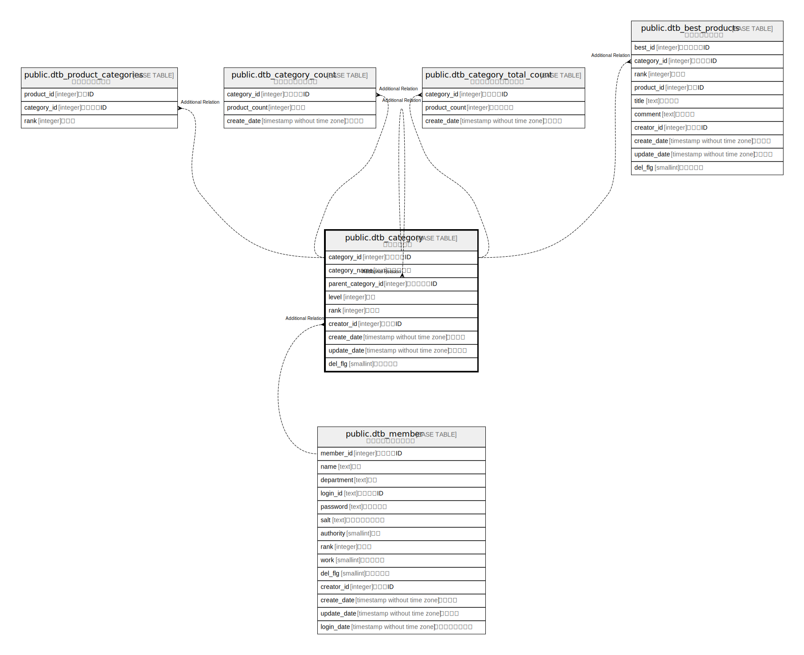

# public.dtb_category

## Description

## Columns

| Name | Type | Default | Nullable | Children | Parents | Comment |
| ---- | ---- | ------- | -------- | -------- | ------- | ------- |
| category_id | integer |  | false |  |  |  |
| category_name | text |  | true |  |  |  |
| parent_category_id | integer | 0 | false |  |  |  |
| level | integer |  | false |  |  |  |
| rank | integer |  | true |  |  |  |
| creator_id | integer |  | false |  |  |  |
| create_date | timestamp without time zone | CURRENT_TIMESTAMP | false |  |  |  |
| update_date | timestamp without time zone |  | false |  |  |  |
| del_flg | smallint | 0 | false |  |  |  |

## Constraints

| Name | Type | Definition |
| ---- | ---- | ---------- |
| dtb_category_pkey | PRIMARY KEY | PRIMARY KEY (category_id) |

## Indexes

| Name | Definition |
| ---- | ---------- |
| dtb_category_pkey | CREATE UNIQUE INDEX dtb_category_pkey ON public.dtb_category USING btree (category_id) |

## Relations

---

> Generated by [tbls](https://github.com/k1LoW/tbls)
