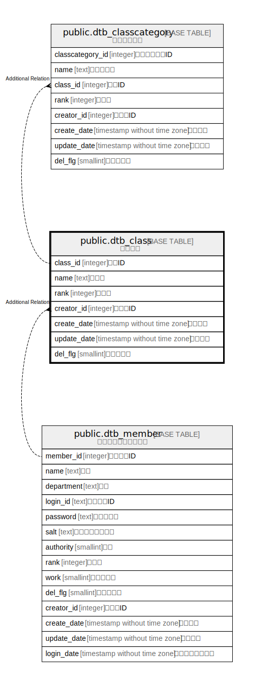

# public.dtb_class

## Description

規格情報

## Columns

| Name | Type | Default | Nullable | Children | Parents | Comment |
| ---- | ---- | ------- | -------- | -------- | ------- | ------- |
| class_id | integer |  | false | [public.dtb_classcategory](public.dtb_classcategory.md) |  | 規格ID |
| name | text |  | true |  |  | 規格名 |
| rank | integer |  | true |  |  | 表示順 |
| creator_id | integer |  | false |  | [public.dtb_member](public.dtb_member.md) | 作成者ID |
| create_date | timestamp without time zone | CURRENT_TIMESTAMP | false |  |  | 作成日時 |
| update_date | timestamp without time zone |  | false |  |  | 更新日時 |
| del_flg | smallint | 0 | false |  |  | 削除フラグ |

## Constraints

| Name | Type | Definition |
| ---- | ---- | ---------- |
| dtb_class_pkey | PRIMARY KEY | PRIMARY KEY (class_id) |

## Indexes

| Name | Definition |
| ---- | ---------- |
| dtb_class_pkey | CREATE UNIQUE INDEX dtb_class_pkey ON public.dtb_class USING btree (class_id) |

## Relations

---

> Generated by [tbls](https://github.com/k1LoW/tbls)
