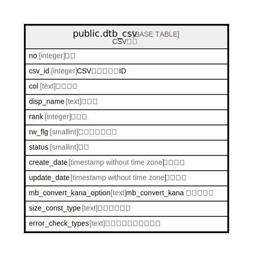

# public.dtb_csv

## Description

CSV情報

## Columns

| Name | Type | Default | Nullable | Children | Parents | Comment |
| ---- | ---- | ------- | -------- | -------- | ------- | ------- |
| no | integer |  | false |  |  | 番号 |
| csv_id | integer |  | false |  |  | CSVマスタ種別ID |
| col | text |  | true |  |  | カラム名 |
| disp_name | text |  | true |  |  | 表示名 |
| rank | integer |  | true |  |  | 表示順 |
| rw_flg | smallint | 1 | true |  |  | 読み書きフラグ |
| status | smallint | 1 | false |  |  | 状態 |
| create_date | timestamp without time zone | CURRENT_TIMESTAMP | false |  |  | 作成日時 |
| update_date | timestamp without time zone |  | false |  |  | 更新日時 |
| mb_convert_kana_option | text |  | true |  |  | mb_convert_kana オプション |
| size_const_type | text |  | true |  |  | 文字長タイプ |
| error_check_types | text |  | true |  |  | エラーチェックタイプ |

## Constraints

| Name | Type | Definition |
| ---- | ---- | ---------- |
| dtb_csv_pkey | PRIMARY KEY | PRIMARY KEY (no) |

## Indexes

| Name | Definition |
| ---- | ---------- |
| dtb_csv_pkey | CREATE UNIQUE INDEX dtb_csv_pkey ON public.dtb_csv USING btree (no) |

## Relations

---

> Generated by [tbls](https://github.com/k1LoW/tbls)
