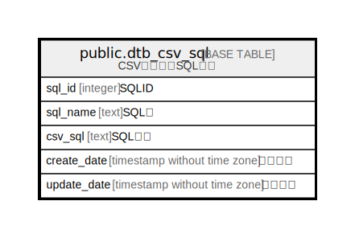

# public.dtb_csv_sql

## Description

CSV詳細設定SQL情報

## Columns

| Name | Type | Default | Nullable | Children | Parents | Comment |
| ---- | ---- | ------- | -------- | -------- | ------- | ------- |
| sql_id | integer |  | false |  |  | SQLID |
| sql_name | text |  | false |  |  | SQL名 |
| csv_sql | text |  | true |  |  | SQL詳細 |
| create_date | timestamp without time zone | CURRENT_TIMESTAMP | false |  |  | 作成日時 |
| update_date | timestamp without time zone |  | false |  |  | 更新日時 |

## Constraints

| Name | Type | Definition |
| ---- | ---- | ---------- |
| dtb_csv_sql_pkey | PRIMARY KEY | PRIMARY KEY (sql_id) |

## Indexes

| Name | Definition |
| ---- | ---------- |
| dtb_csv_sql_pkey | CREATE UNIQUE INDEX dtb_csv_sql_pkey ON public.dtb_csv_sql USING btree (sql_id) |

## Relations

---

> Generated by [tbls](https://github.com/k1LoW/tbls)
