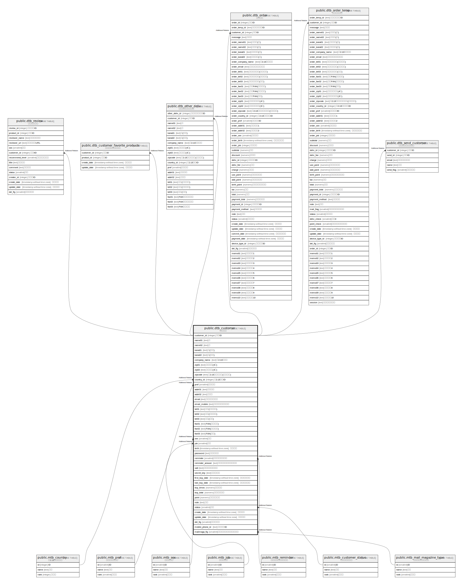

# public.dtb_customer

## Description

## Columns

| Name | Type | Default | Nullable | Children | Parents | Comment |
| ---- | ---- | ------- | -------- | -------- | ------- | ------- |
| customer_id | integer |  | false |  |  |  |
| name01 | text |  | false |  |  |  |
| name02 | text |  | false |  |  |  |
| kana01 | text |  | true |  |  |  |
| kana02 | text |  | true |  |  |  |
| company_name | text |  | true |  |  |  |
| zip01 | text |  | true |  |  |  |
| zip02 | text |  | true |  |  |  |
| zipcode | text |  | true |  |  |  |
| country_id | integer |  | true |  |  |  |
| pref | smallint |  | true |  |  |  |
| addr01 | text |  | true |  |  |  |
| addr02 | text |  | true |  |  |  |
| email | text |  | false |  |  |  |
| email_mobile | text |  | true |  |  |  |
| tel01 | text |  | true |  |  |  |
| tel02 | text |  | true |  |  |  |
| tel03 | text |  | true |  |  |  |
| fax01 | text |  | true |  |  |  |
| fax02 | text |  | true |  |  |  |
| fax03 | text |  | true |  |  |  |
| sex | smallint |  | true |  |  |  |
| job | smallint |  | true |  |  |  |
| birth | timestamp without time zone |  | true |  |  |  |
| password | text |  | true |  |  |  |
| reminder | smallint |  | true |  |  |  |
| reminder_answer | text |  | true |  |  |  |
| salt | text |  | true |  |  |  |
| secret_key | text |  | false |  |  |  |
| first_buy_date | timestamp without time zone |  | true |  |  |  |
| last_buy_date | timestamp without time zone |  | true |  |  |  |
| buy_times | numeric | 0 | true |  |  |  |
| buy_total | numeric | 0 | true |  |  |  |
| point | numeric | 0 | false |  |  |  |
| note | text |  | true |  |  |  |
| status | smallint | 1 | false |  |  |  |
| create_date | timestamp without time zone | CURRENT_TIMESTAMP | false |  |  |  |
| update_date | timestamp without time zone |  | false |  |  |  |
| del_flg | smallint | 0 | false |  |  |  |
| mobile_phone_id | text |  | true |  |  |  |
| mailmaga_flg | smallint |  | true |  |  |  |

## Constraints

| Name | Type | Definition |
| ---- | ---- | ---------- |
| dtb_customer_pkey | PRIMARY KEY | PRIMARY KEY (customer_id) |
| dtb_customer_secret_key_key | UNIQUE | UNIQUE (secret_key) |

## Indexes

| Name | Definition |
| ---- | ---------- |
| dtb_customer_pkey | CREATE UNIQUE INDEX dtb_customer_pkey ON public.dtb_customer USING btree (customer_id) |
| dtb_customer_secret_key_key | CREATE UNIQUE INDEX dtb_customer_secret_key_key ON public.dtb_customer USING btree (secret_key) |
| dtb_customer_mobile_phone_id_key | CREATE INDEX dtb_customer_mobile_phone_id_key ON public.dtb_customer USING btree (mobile_phone_id) |

## Relations

---

> Generated by [tbls](https://github.com/k1LoW/tbls)
