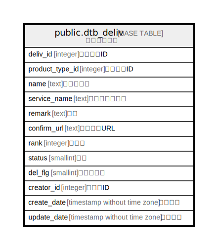

# public.dtb_deliv

## Description

配送業者情報

## Columns

| Name | Type | Default | Nullable | Children | Parents | Comment |
| ---- | ---- | ------- | -------- | -------- | ------- | ------- |
| deliv_id | integer |  | false | [public.dtb_order](public.dtb_order.md) [public.dtb_order_temp](public.dtb_order_temp.md) [public.dtb_payment_options](public.dtb_payment_options.md) [public.dtb_delivtime](public.dtb_delivtime.md) [public.dtb_delivfee](public.dtb_delivfee.md) |  | 配送業者ID |
| product_type_id | integer |  | true |  | [public.mtb_product_type](public.mtb_product_type.md) | 商品種別ID |
| name | text |  | true |  |  | 配送業者名 |
| service_name | text |  | true |  |  | 配送サービス名 |
| remark | text |  | true |  |  | 説明 |
| confirm_url | text |  | true |  |  | 伝票確認URL |
| rank | integer |  | true |  |  | 表示順 |
| status | smallint | 1 | false |  |  | 状態 |
| del_flg | smallint | 0 | false |  |  | 削除フラグ |
| creator_id | integer |  | false |  | [public.dtb_member](public.dtb_member.md) | 作成者ID |
| create_date | timestamp without time zone | CURRENT_TIMESTAMP | false |  |  | 作成日時 |
| update_date | timestamp without time zone |  | false |  |  | 更新日時 |

## Constraints

| Name | Type | Definition |
| ---- | ---- | ---------- |
| dtb_deliv_pkey | PRIMARY KEY | PRIMARY KEY (deliv_id) |

## Indexes

| Name | Definition |
| ---- | ---------- |
| dtb_deliv_pkey | CREATE UNIQUE INDEX dtb_deliv_pkey ON public.dtb_deliv USING btree (deliv_id) |

## Relations

---

> Generated by [tbls](https://github.com/k1LoW/tbls)
