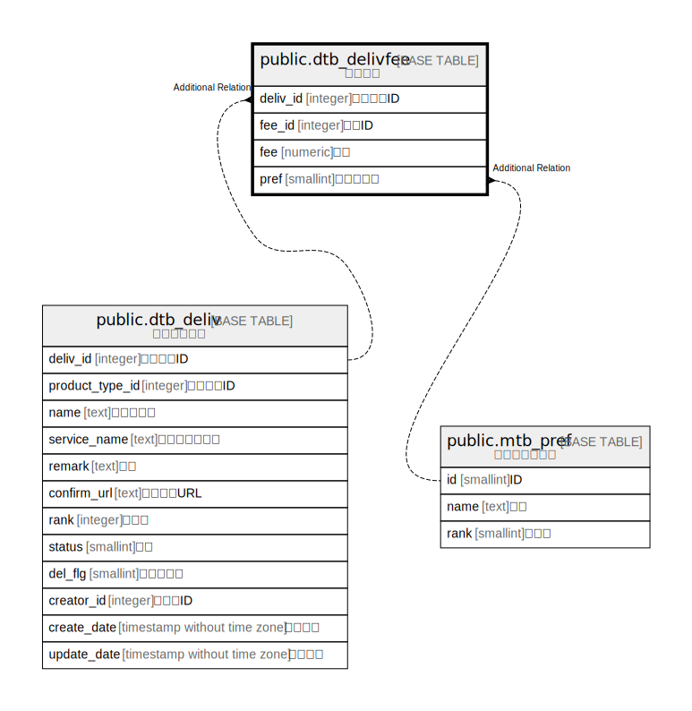

# public.dtb_delivfee

## Description

送料情報

## Columns

| Name | Type | Default | Nullable | Children | Parents | Comment |
| ---- | ---- | ------- | -------- | -------- | ------- | ------- |
| deliv_id | integer |  | false |  | [public.dtb_deliv](public.dtb_deliv.md) | 配送業者ID |
| fee_id | integer |  | false |  |  | 送料ID |
| fee | numeric |  | false |  |  | 送料 |
| pref | smallint |  | true |  | [public.mtb_pref](public.mtb_pref.md) | 都道府県名 |

## Constraints

| Name | Type | Definition |
| ---- | ---- | ---------- |
| dtb_delivfee_pkey | PRIMARY KEY | PRIMARY KEY (deliv_id, fee_id) |

## Indexes

| Name | Definition |
| ---- | ---------- |
| dtb_delivfee_pkey | CREATE UNIQUE INDEX dtb_delivfee_pkey ON public.dtb_delivfee USING btree (deliv_id, fee_id) |

## Relations

---

> Generated by [tbls](https://github.com/k1LoW/tbls)
