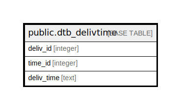

# public.dtb_delivtime

## Description

配送時間情報

## Columns

| Name | Type | Default | Nullable | Children | Parents | Comment |
| ---- | ---- | ------- | -------- | -------- | ------- | ------- |
| deliv_id | integer |  | false |  | [public.dtb_deliv](public.dtb_deliv.md) | 配送業者ID |
| time_id | integer |  | false | [public.dtb_shipping](public.dtb_shipping.md) |  | 配送時間ID |
| deliv_time | text |  | false |  |  | 配送時間 |

## Constraints

| Name | Type | Definition |
| ---- | ---- | ---------- |
| dtb_delivtime_pkey | PRIMARY KEY | PRIMARY KEY (deliv_id, time_id) |

## Indexes

| Name | Definition |
| ---- | ---------- |
| dtb_delivtime_pkey | CREATE UNIQUE INDEX dtb_delivtime_pkey ON public.dtb_delivtime USING btree (deliv_id, time_id) |

## Relations

---

> Generated by [tbls](https://github.com/k1LoW/tbls)
