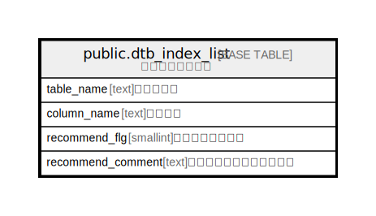

# public.dtb_index_list

## Description

インデックス一覧

## Columns

| Name | Type | Default | Nullable | Children | Parents | Comment |
| ---- | ---- | ------- | -------- | -------- | ------- | ------- |
| table_name | text |  | false |  |  | テーブル名 |
| column_name | text |  | false |  |  | カラム名 |
| recommend_flg | smallint | 0 | false |  |  | レコメンドフラグ |
| recommend_comment | text |  | true |  |  | レコメンドフラグコメント |

## Constraints

| Name | Type | Definition |
| ---- | ---- | ---------- |
| dtb_index_list_pkey | PRIMARY KEY | PRIMARY KEY (table_name, column_name) |

## Indexes

| Name | Definition |
| ---- | ---------- |
| dtb_index_list_pkey | CREATE UNIQUE INDEX dtb_index_list_pkey ON public.dtb_index_list USING btree (table_name, column_name) |

## Relations

---

> Generated by [tbls](https://github.com/k1LoW/tbls)
