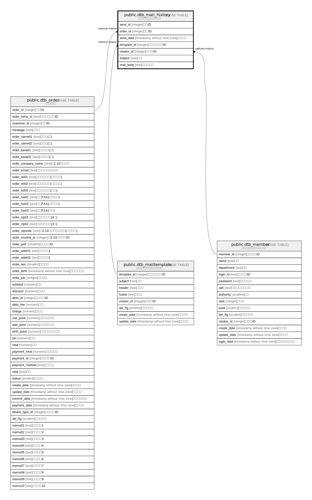

# public.dtb_mail_history

## Description

受注メール送信履歴

## Columns

| Name | Type | Default | Nullable | Children | Parents | Comment |
| ---- | ---- | ------- | -------- | -------- | ------- | ------- |
| send_id | integer |  | false |  |  | 送信ID |
| order_id | integer |  | false |  |  | 受注ID |
| send_date | timestamp without time zone |  | true |  |  | 送信日時 |
| template_id | integer |  | true |  |  | テンプレートID |
| creator_id | integer |  | false |  |  | 作成者ID |
| subject | text |  | true |  |  | 件名 |
| mail_body | text |  | true |  |  | メール本文 |

## Constraints

| Name | Type | Definition |
| ---- | ---- | ---------- |
| dtb_mail_history_pkey | PRIMARY KEY | PRIMARY KEY (send_id) |

## Indexes

| Name | Definition |
| ---- | ---------- |
| dtb_mail_history_pkey | CREATE UNIQUE INDEX dtb_mail_history_pkey ON public.dtb_mail_history USING btree (send_id) |

## Relations

---

> Generated by [tbls](https://github.com/k1LoW/tbls)
