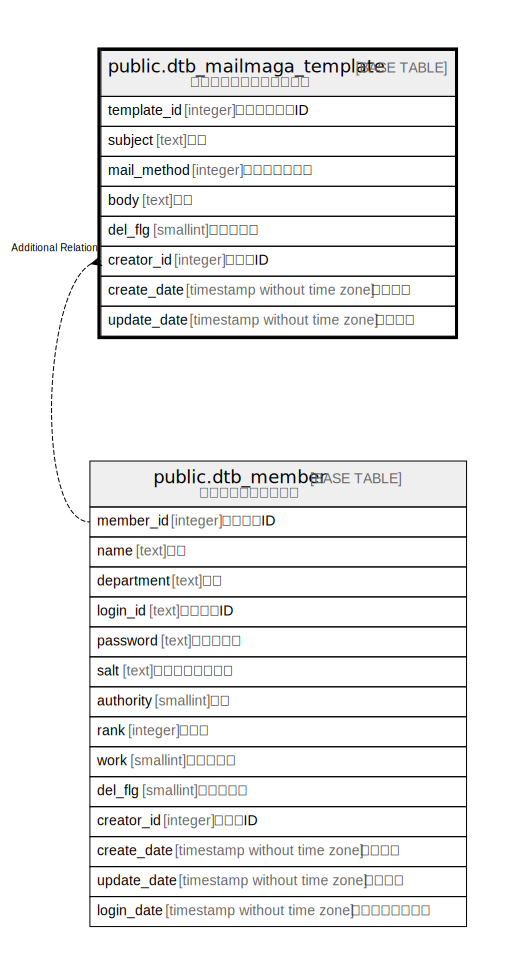

# public.dtb_mailmaga_template

## Description

メルマガテンプレート情報

## Columns

| Name | Type | Default | Nullable | Children | Parents | Comment |
| ---- | ---- | ------- | -------- | -------- | ------- | ------- |
| template_id | integer |  | false |  |  | テンプレートID |
| subject | text |  | true |  |  | 件名 |
| mail_method | integer |  | true |  |  | メール送信方法 |
| body | text |  | true |  |  | 本文 |
| del_flg | smallint | 0 | false |  |  | 削除フラグ |
| creator_id | integer |  | false |  | [public.dtb_member](public.dtb_member.md) | 作成者ID |
| create_date | timestamp without time zone | CURRENT_TIMESTAMP | false |  |  | 作成日時 |
| update_date | timestamp without time zone |  | false |  |  | 更新日時 |

## Constraints

| Name | Type | Definition |
| ---- | ---- | ---------- |
| dtb_mailmaga_template_pkey | PRIMARY KEY | PRIMARY KEY (template_id) |

## Indexes

| Name | Definition |
| ---- | ---------- |
| dtb_mailmaga_template_pkey | CREATE UNIQUE INDEX dtb_mailmaga_template_pkey ON public.dtb_mailmaga_template USING btree (template_id) |

## Relations

---

> Generated by [tbls](https://github.com/k1LoW/tbls)
