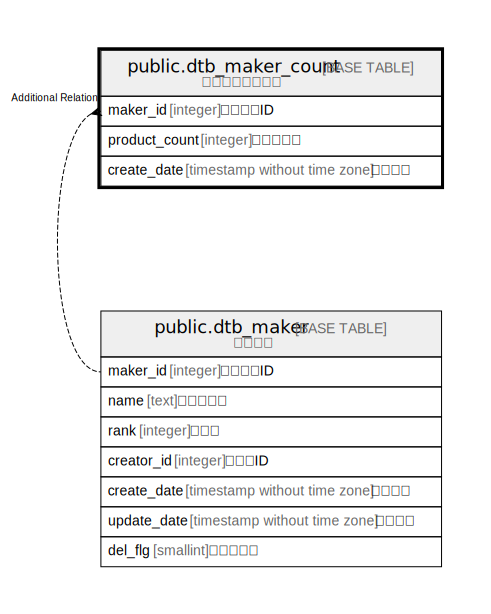

# public.dtb_maker_count

## Description

メーカーカウント

## Columns

| Name | Type | Default | Nullable | Children | Parents | Comment |
| ---- | ---- | ------- | -------- | -------- | ------- | ------- |
| maker_id | integer |  | false |  | [public.dtb_maker](public.dtb_maker.md) | メーカーID |
| product_count | integer |  | false |  |  | 登録商品数 |
| create_date | timestamp without time zone | CURRENT_TIMESTAMP | false |  |  | 作成日時 |

## Constraints

| Name | Type | Definition |
| ---- | ---- | ---------- |
| dtb_maker_count_pkey | PRIMARY KEY | PRIMARY KEY (maker_id) |

## Indexes

| Name | Definition |
| ---- | ---------- |
| dtb_maker_count_pkey | CREATE UNIQUE INDEX dtb_maker_count_pkey ON public.dtb_maker_count USING btree (maker_id) |

## Relations

---

> Generated by [tbls](https://github.com/k1LoW/tbls)
