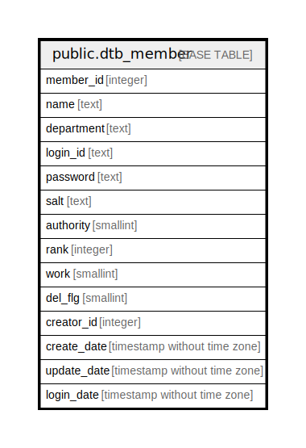

# public.dtb_member

## Description

管理画面メンバー情報

## Columns

| Name | Type | Default | Nullable | Children | Parents | Comment |
| ---- | ---- | ------- | -------- | -------- | ------- | ------- |
| member_id | integer |  | false | [public.dtb_products_class](public.dtb_products_class.md) [public.dtb_classcategory](public.dtb_classcategory.md) [public.dtb_class](public.dtb_class.md) [public.dtb_product_status](public.dtb_product_status.md) [public.dtb_products](public.dtb_products.md) [public.dtb_category](public.dtb_category.md) [public.dtb_recommend_products](public.dtb_recommend_products.md) [public.dtb_best_products](public.dtb_best_products.md) [public.dtb_review](public.dtb_review.md) [public.dtb_deliv](public.dtb_deliv.md) [public.dtb_payment](public.dtb_payment.md) [public.dtb_mail_history](public.dtb_mail_history.md) [public.dtb_send_history](public.dtb_send_history.md) [public.dtb_mailtemplate](public.dtb_mailtemplate.md) [public.dtb_mailmaga_template](public.dtb_mailmaga_template.md) [public.dtb_holiday](public.dtb_holiday.md) [public.dtb_kiyaku](public.dtb_kiyaku.md) [public.dtb_maker](public.dtb_maker.md) [public.dtb_member](public.dtb_member.md) [public.dtb_news](public.dtb_news.md) [public.dtb_tax_rule](public.dtb_tax_rule.md) |  | メンバーID |
| name | text |  | true |  |  | 名前 |
| department | text |  | true |  |  | 部門 |
| login_id | text |  | false |  |  | ログインID |
| password | text |  | false |  |  | パスワード |
| salt | text |  | false |  |  | 暗号化付与文字列 |
| authority | smallint |  | false |  |  | 権限 |
| rank | integer | 0 | false |  |  | 表示順 |
| work | smallint | 1 | false |  | [public.mtb_work](public.mtb_work.md) | 稼動フラグ |
| del_flg | smallint | 0 | false |  |  | 削除フラグ |
| creator_id | integer |  | false |  | [public.dtb_member](public.dtb_member.md) | 作成者ID |
| create_date | timestamp without time zone | CURRENT_TIMESTAMP | false |  |  | 作成日時 |
| update_date | timestamp without time zone |  | false |  |  | 更新日付 |
| login_date | timestamp without time zone |  | true |  |  | 最終ログイン日時 |

## Constraints

| Name | Type | Definition |
| ---- | ---- | ---------- |
| dtb_member_pkey | PRIMARY KEY | PRIMARY KEY (member_id) |

## Indexes

| Name | Definition |
| ---- | ---------- |
| dtb_member_pkey | CREATE UNIQUE INDEX dtb_member_pkey ON public.dtb_member USING btree (member_id) |

## Relations

---

> Generated by [tbls](https://github.com/k1LoW/tbls)
