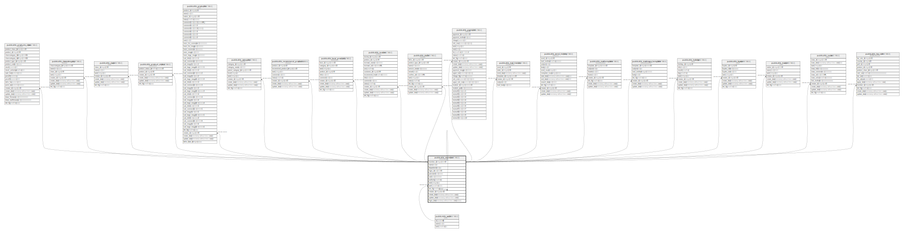

# public.dtb_member

## Description

管理画面メンバー情報

## Columns

| Name | Type | Default | Nullable | Children | Parents | Comment |
| ---- | ---- | ------- | -------- | -------- | ------- | ------- |
| member_id | integer |  | false |  |  | メンバーID |
| name | text |  | true |  |  | 名前 |
| department | text |  | true |  |  | 部門 |
| login_id | text |  | false |  |  | ログインID |
| password | text |  | false |  |  | パスワード |
| salt | text |  | false |  |  | 暗号化付与文字列 |
| authority | smallint |  | false |  |  | 権限 |
| rank | integer | 0 | false |  |  | 表示順 |
| work | smallint | 1 | false |  |  | 稼動フラグ |
| del_flg | smallint | 0 | false |  |  | 削除フラグ |
| creator_id | integer |  | false |  |  | 作成者ID |
| create_date | timestamp without time zone | CURRENT_TIMESTAMP | false |  |  | 作成日時 |
| update_date | timestamp without time zone |  | false |  |  | 更新日付 |
| login_date | timestamp without time zone |  | true |  |  | 最終ログイン日時 |

## Constraints

| Name | Type | Definition |
| ---- | ---- | ---------- |
| dtb_member_pkey | PRIMARY KEY | PRIMARY KEY (member_id) |

## Indexes

| Name | Definition |
| ---- | ---------- |
| dtb_member_pkey | CREATE UNIQUE INDEX dtb_member_pkey ON public.dtb_member USING btree (member_id) |

## Relations

---

> Generated by [tbls](https://github.com/k1LoW/tbls)
