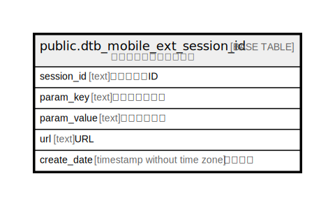

# public.dtb_mobile_ext_session_id

## Description

モバイルセッション情報

## Columns

| Name | Type | Default | Nullable | Children | Parents | Comment |
| ---- | ---- | ------- | -------- | -------- | ------- | ------- |
| session_id | text |  | false |  |  | セッションID |
| param_key | text |  | true |  |  | パラメータキー |
| param_value | text |  | true |  |  | パラメータ値 |
| url | text |  | true |  |  | URL |
| create_date | timestamp without time zone | CURRENT_TIMESTAMP | false |  |  | 作成日時 |

## Constraints

| Name | Type | Definition |
| ---- | ---- | ---------- |
| dtb_mobile_ext_session_id_pkey | PRIMARY KEY | PRIMARY KEY (session_id) |

## Indexes

| Name | Definition |
| ---- | ---------- |
| dtb_mobile_ext_session_id_pkey | CREATE UNIQUE INDEX dtb_mobile_ext_session_id_pkey ON public.dtb_mobile_ext_session_id USING btree (session_id) |
| dtb_mobile_ext_session_id_param_key_key | CREATE INDEX dtb_mobile_ext_session_id_param_key_key ON public.dtb_mobile_ext_session_id USING btree (param_key) |
| dtb_mobile_ext_session_id_param_value_key | CREATE INDEX dtb_mobile_ext_session_id_param_value_key ON public.dtb_mobile_ext_session_id USING btree (param_value) |
| dtb_mobile_ext_session_id_url_key | CREATE INDEX dtb_mobile_ext_session_id_url_key ON public.dtb_mobile_ext_session_id USING btree (url) |
| dtb_mobile_ext_session_id_create_date_key | CREATE INDEX dtb_mobile_ext_session_id_create_date_key ON public.dtb_mobile_ext_session_id USING btree (create_date) |

## Relations

---

> Generated by [tbls](https://github.com/k1LoW/tbls)
