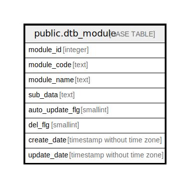

# public.dtb_module

## Description

モジュール情報

## Columns

| Name | Type | Default | Nullable | Children | Parents | Comment |
| ---- | ---- | ------- | -------- | -------- | ------- | ------- |
| module_id | integer |  | false | [public.dtb_payment](public.dtb_payment.md) [public.dtb_update](public.dtb_update.md) [public.dtb_module_update_logs](public.dtb_module_update_logs.md) |  | モジュールID |
| module_code | text |  | false |  |  | モジュールコード |
| module_name | text |  | false |  |  | モジュール名 |
| sub_data | text |  | true |  |  | データ |
| auto_update_flg | smallint | 0 | false |  |  | 自動更新フラグ |
| del_flg | smallint | 0 | false |  |  | 削除フラグ |
| create_date | timestamp without time zone | CURRENT_TIMESTAMP | false |  |  | 作成日時 |
| update_date | timestamp without time zone |  | false |  |  | 更新日時 |

## Constraints

| Name | Type | Definition |
| ---- | ---- | ---------- |
| dtb_module_pkey | PRIMARY KEY | PRIMARY KEY (module_id) |

## Indexes

| Name | Definition |
| ---- | ---------- |
| dtb_module_pkey | CREATE UNIQUE INDEX dtb_module_pkey ON public.dtb_module USING btree (module_id) |

## Relations

---

> Generated by [tbls](https://github.com/k1LoW/tbls)
