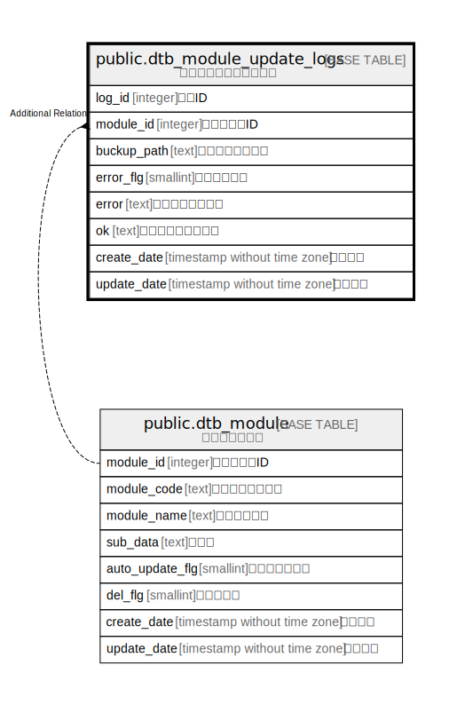

# public.dtb_module_update_logs

## Description

モジュール更新ログ情報

## Columns

| Name | Type | Default | Nullable | Children | Parents | Comment |
| ---- | ---- | ------- | -------- | -------- | ------- | ------- |
| log_id | integer |  | false |  |  | ログID |
| module_id | integer |  | false |  | [public.dtb_module](public.dtb_module.md) | モジュールID |
| buckup_path | text |  | true |  |  | バックアップパス |
| error_flg | smallint | 0 | true |  |  | エラーフラグ |
| error | text |  | true |  |  | エラーメッセージ |
| ok | text |  | true |  |  | 正常終了メッセージ |
| create_date | timestamp without time zone | CURRENT_TIMESTAMP | false |  |  | 作成日時 |
| update_date | timestamp without time zone |  | false |  |  | 更新日時 |

## Constraints

| Name | Type | Definition |
| ---- | ---- | ---------- |
| dtb_module_update_logs_pkey | PRIMARY KEY | PRIMARY KEY (log_id) |

## Indexes

| Name | Definition |
| ---- | ---------- |
| dtb_module_update_logs_pkey | CREATE UNIQUE INDEX dtb_module_update_logs_pkey ON public.dtb_module_update_logs USING btree (log_id) |

## Relations

---

> Generated by [tbls](https://github.com/k1LoW/tbls)
