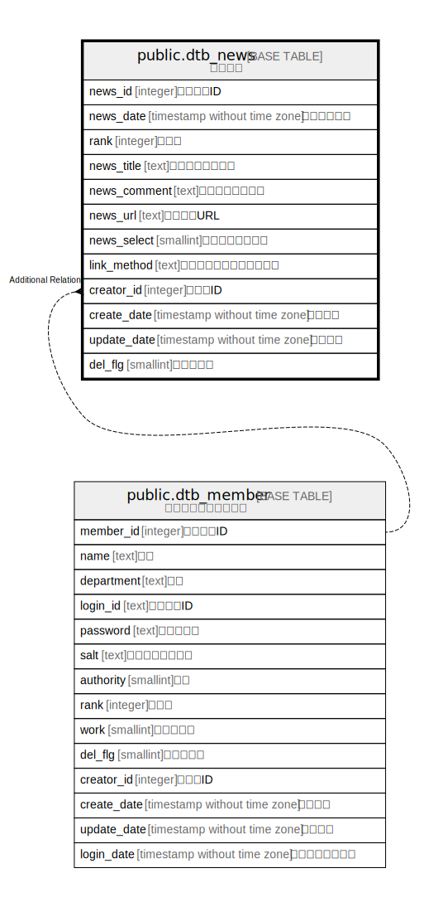

# public.dtb_news

## Description

新着情報

## Columns

| Name | Type | Default | Nullable | Children | Parents | Comment |
| ---- | ---- | ------- | -------- | -------- | ------- | ------- |
| news_id | integer |  | false |  |  | 新着情報ID |
| news_date | timestamp without time zone |  | true |  |  | 新着情報日付 |
| rank | integer |  | true |  |  | 表示順 |
| news_title | text |  | false |  |  | 新着情報タイトル |
| news_comment | text |  | true |  |  | 新着情報コメント |
| news_url | text |  | true |  |  | 新着情報URL |
| news_select | smallint | 0 | false |  |  | 不明（未使用？） |
| link_method | text |  | true |  |  | 別ウィンドウで開くフラグ |
| creator_id | integer |  | false |  | [public.dtb_member](public.dtb_member.md) | 作成者ID |
| create_date | timestamp without time zone | CURRENT_TIMESTAMP | false |  |  | 作成日時 |
| update_date | timestamp without time zone |  | false |  |  | 更新日時 |
| del_flg | smallint | 0 | false |  |  | 削除フラグ |

## Constraints

| Name | Type | Definition |
| ---- | ---- | ---------- |
| dtb_news_pkey | PRIMARY KEY | PRIMARY KEY (news_id) |

## Indexes

| Name | Definition |
| ---- | ---------- |
| dtb_news_pkey | CREATE UNIQUE INDEX dtb_news_pkey ON public.dtb_news USING btree (news_id) |

## Relations

---

> Generated by [tbls](https://github.com/k1LoW/tbls)
