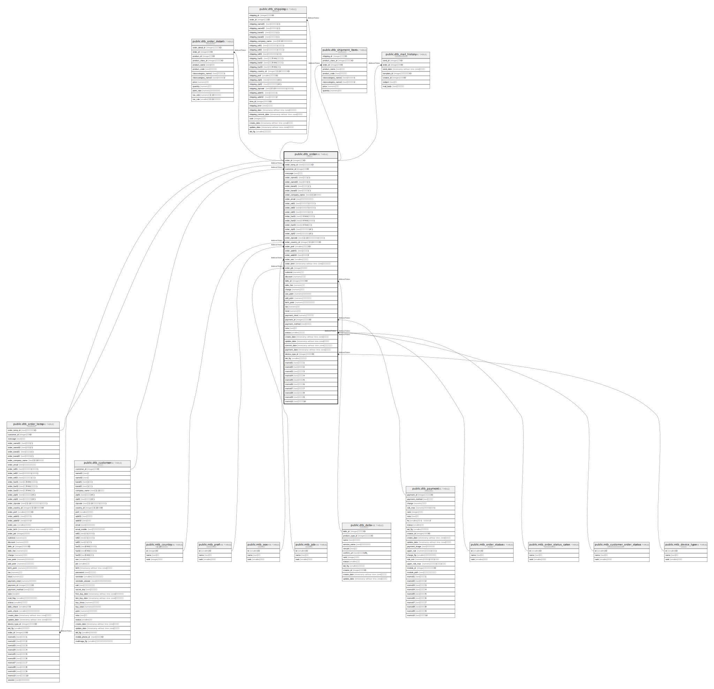

# public.dtb_order

## Description

受注情報

## Columns

| Name | Type | Default | Nullable | Children | Parents | Comment |
| ---- | ---- | ------- | -------- | -------- | ------- | ------- |
| order_id | integer |  | false | [public.dtb_order_temp](public.dtb_order_temp.md) [public.dtb_order_detail](public.dtb_order_detail.md) [public.dtb_shipping](public.dtb_shipping.md) [public.dtb_shipment_item](public.dtb_shipment_item.md) [public.dtb_mail_history](public.dtb_mail_history.md) |  | 受注ID |
| order_temp_id | text |  | true |  | [public.dtb_order_temp](public.dtb_order_temp.md) | 受注一時情報ID |
| customer_id | integer |  | false |  | [public.dtb_customer](public.dtb_customer.md) | 顧客ID |
| message | text |  | true |  |  | 要望等 |
| order_name01 | text |  | true |  |  | 顧客名(姓) |
| order_name02 | text |  | true |  |  | 顧客名(名) |
| order_kana01 | text |  | true |  |  | 顧客カナ(姓) |
| order_kana02 | text |  | true |  |  | 顧客カナ(名) |
| order_company_name | text |  | true |  |  | 【2.13】会社名 |
| order_email | text |  | true |  |  | 顧客メールアドレス |
| order_tel01 | text |  | true |  |  | 顧客電話番号(市外局番) |
| order_tel02 | text |  | true |  |  | 顧客電話番号(市内局番) |
| order_tel03 | text |  | true |  |  | 顧客電話番号(局番) |
| order_fax01 | text |  | true |  |  | 顧客FAX(市外局番) |
| order_fax02 | text |  | true |  |  | 顧客FAX(市内局番) |
| order_fax03 | text |  | true |  |  | 顧客FAX(局番) |
| order_zip01 | text |  | true |  |  | 顧客郵便番号(4桁) |
| order_zip02 | text |  | true |  |  | 顧客郵便番号(3桁) |
| order_zipcode | text |  | true |  |  | 【2.13】顧客郵便番号(海外対応) |
| order_country_id | integer |  | true |  | [public.mtb_country](public.mtb_country.md) | 【2.13】顧客国ID |
| order_pref | smallint |  | true |  | [public.mtb_pref](public.mtb_pref.md) | 都道府県ID |
| order_addr01 | text |  | true |  |  | 顧客住所1 |
| order_addr02 | text |  | true |  |  | 顧客住所2 |
| order_sex | smallint |  | true |  | [public.mtb_sex](public.mtb_sex.md) | 顧客性別 |
| order_birth | timestamp without time zone |  | true |  |  | 顧客生年月日 |
| order_job | integer |  | true |  | [public.mtb_job](public.mtb_job.md) | 顧客職業 |
| subtotal | numeric |  | true |  |  | 小計 |
| discount | numeric | 0 | false |  |  | 値引き |
| deliv_id | integer |  | true |  | [public.dtb_deliv](public.dtb_deliv.md) | 配送業者ID |
| deliv_fee | numeric |  | true |  |  | 送料 |
| charge | numeric |  | true |  |  | 手数料 |
| use_point | numeric | 0 | false |  |  | 使用ポイント |
| add_point | numeric | 0 | false |  |  | 加算ポイント |
| birth_point | numeric | 0 | false |  |  | お誕生日ポイント |
| tax | numeric |  | true |  |  | 税金 |
| total | numeric |  | true |  |  | 合計 |
| payment_total | numeric |  | true |  |  | 支払い合計 |
| payment_id | integer |  | true |  | [public.dtb_payment](public.dtb_payment.md) | 支払方法ID |
| payment_method | text |  | true |  |  | 支払方法 |
| note | text |  | true |  |  | 備考 |
| status | smallint |  | true |  | [public.mtb_order_status](public.mtb_order_status.md) [public.mtb_order_status_color](public.mtb_order_status_color.md) [public.mtb_customer_order_status](public.mtb_customer_order_status.md) | 受注状態 |
| create_date | timestamp without time zone | CURRENT_TIMESTAMP | false |  |  | 作成日時 |
| update_date | timestamp without time zone |  | false |  |  | 更新日時 |
| commit_date | timestamp without time zone |  | true |  |  | 発送済み日時 |
| payment_date | timestamp without time zone |  | true |  |  | 入金日時 |
| device_type_id | integer |  | true |  | [public.mtb_device_type](public.mtb_device_type.md) | 端末種別ID |
| del_flg | smallint | 0 | false |  |  | 削除フラグ |
| memo01 | text |  | true |  |  | 汎用項目1 |
| memo02 | text |  | true |  |  | 汎用項目2 |
| memo03 | text |  | true |  |  | 汎用項目3 |
| memo04 | text |  | true |  |  | 汎用項目4 |
| memo05 | text |  | true |  |  | 汎用項目5 |
| memo06 | text |  | true |  |  | 汎用項目6 |
| memo07 | text |  | true |  |  | 汎用項目7 |
| memo08 | text |  | true |  |  | 汎用項目8 |
| memo09 | text |  | true |  |  | 汎用項目9 |
| memo10 | text |  | true |  |  | 汎用項目10 |

## Constraints

| Name | Type | Definition |
| ---- | ---- | ---------- |
| dtb_order_pkey | PRIMARY KEY | PRIMARY KEY (order_id) |

## Indexes

| Name | Definition |
| ---- | ---------- |
| dtb_order_pkey | CREATE UNIQUE INDEX dtb_order_pkey ON public.dtb_order USING btree (order_id) |
| dtb_order_customer_id_key | CREATE INDEX dtb_order_customer_id_key ON public.dtb_order USING btree (customer_id) |

## Relations

---

> Generated by [tbls](https://github.com/k1LoW/tbls)
