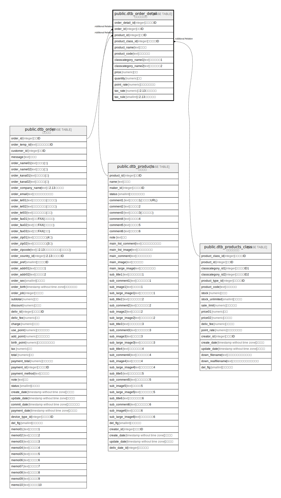

# public.dtb_order_detail

## Description

受注詳細情報

## Columns

| Name | Type | Default | Nullable | Children | Parents | Comment |
| ---- | ---- | ------- | -------- | -------- | ------- | ------- |
| order_detail_id | integer |  | false |  |  | 受注詳細ID |
| order_id | integer |  | false |  | [public.dtb_order](public.dtb_order.md) | 受注ID |
| product_id | integer |  | false |  | [public.dtb_products](public.dtb_products.md) | 商品ID |
| product_class_id | integer |  | false |  | [public.dtb_products_class](public.dtb_products_class.md) | 商品規格ID |
| product_name | text |  | false |  |  | 商品名 |
| product_code | text |  | true |  |  | 商品コード |
| classcategory_name1 | text |  | true |  |  | 商品規格名1 |
| classcategory_name2 | text |  | true |  |  | 商品規格名2 |
| price | numeric |  | true |  |  | 価格 |
| quantity | numeric |  | true |  |  | 個数 |
| point_rate | numeric | 0 | false |  |  | ポイント付与率 |
| tax_rate | numeric |  | true |  |  | 【2.13】消費税率 |
| tax_rule | smallint |  | true |  |  | 【2.13】課税規則 |

## Constraints

| Name | Type | Definition |
| ---- | ---- | ---------- |
| dtb_order_detail_pkey | PRIMARY KEY | PRIMARY KEY (order_detail_id) |

## Indexes

| Name | Definition |
| ---- | ---------- |
| dtb_order_detail_pkey | CREATE UNIQUE INDEX dtb_order_detail_pkey ON public.dtb_order_detail USING btree (order_detail_id) |
| dtb_order_detail_order_id_key | CREATE INDEX dtb_order_detail_order_id_key ON public.dtb_order_detail USING btree (order_id) |
| dtb_order_detail_product_id_key | CREATE INDEX dtb_order_detail_product_id_key ON public.dtb_order_detail USING btree (product_id) |

## Relations

---

> Generated by [tbls](https://github.com/k1LoW/tbls)
