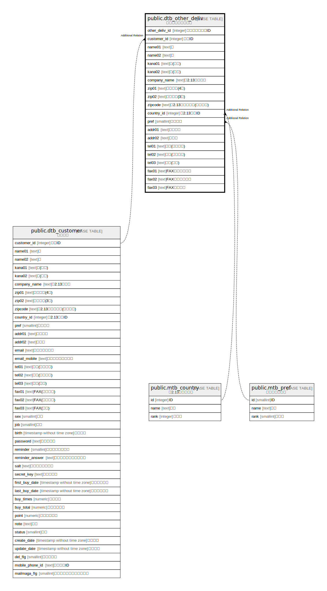

# public.dtb_other_deliv

## Description

その他の配送先情報

## Columns

| Name | Type | Default | Nullable | Children | Parents | Comment |
| ---- | ---- | ------- | -------- | -------- | ------- | ------- |
| other_deliv_id | integer |  | false |  |  | その他の配送先ID |
| customer_id | integer |  | false |  | [public.dtb_customer](public.dtb_customer.md) | 顧客ID |
| name01 | text |  | true |  |  | 姓 |
| name02 | text |  | true |  |  | 名 |
| kana01 | text |  | true |  |  | 姓(カナ) |
| kana02 | text |  | true |  |  | 名(カナ) |
| company_name | text |  | true |  |  | 【2.13】会社名 |
| zip01 | text |  | true |  |  | 郵便番号(4桁) |
| zip02 | text |  | true |  |  | 郵便番号(3桁) |
| zipcode | text |  | true |  |  | 【2.13】郵便番号(海外対応) |
| country_id | integer |  | true |  | [public.mtb_country](public.mtb_country.md) | 【2.13】国ID |
| pref | smallint |  | true |  | [public.mtb_pref](public.mtb_pref.md) | 都道府県 |
| addr01 | text |  | true |  |  | 市区町村 |
| addr02 | text |  | true |  |  | 番地等 |
| tel01 | text |  | true |  |  | 電話(市外局番) |
| tel02 | text |  | true |  |  | 電話(市内局番) |
| tel03 | text |  | true |  |  | 電話(局番) |
| fax01 | text |  | true |  |  | FAX（市外局番） |
| fax02 | text |  | true |  |  | FAX（市内局番） |
| fax03 | text |  | true |  |  | FAX（局番） |

## Constraints

| Name | Type | Definition |
| ---- | ---- | ---------- |
| dtb_other_deliv_pkey | PRIMARY KEY | PRIMARY KEY (other_deliv_id) |

## Indexes

| Name | Definition |
| ---- | ---------- |
| dtb_other_deliv_pkey | CREATE UNIQUE INDEX dtb_other_deliv_pkey ON public.dtb_other_deliv USING btree (other_deliv_id) |

## Relations

---

> Generated by [tbls](https://github.com/k1LoW/tbls)
