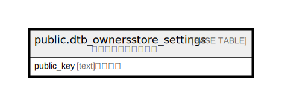

# public.dtb_ownersstore_settings

## Description

オーナーズストア設定

## Columns

| Name | Type | Default | Nullable | Children | Parents | Comment |
| ---- | ---- | ------- | -------- | -------- | ------- | ------- |
| public_key | text |  | false |  |  | 認証キー |

## Constraints

| Name | Type | Definition |
| ---- | ---- | ---------- |
| dtb_ownersstore_settings_pkey | PRIMARY KEY | PRIMARY KEY (public_key) |

## Indexes

| Name | Definition |
| ---- | ---------- |
| dtb_ownersstore_settings_pkey | CREATE UNIQUE INDEX dtb_ownersstore_settings_pkey ON public.dtb_ownersstore_settings USING btree (public_key) |

## Relations

---

> Generated by [tbls](https://github.com/k1LoW/tbls)
