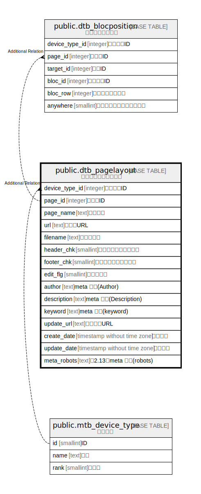

# public.dtb_pagelayout

## Description

ページレイアウト情報

## Columns

| Name | Type | Default | Nullable | Children | Parents | Comment |
| ---- | ---- | ------- | -------- | -------- | ------- | ------- |
| device_type_id | integer |  | false |  | [public.mtb_device_type](public.mtb_device_type.md) | 端末種別ID |
| page_id | integer |  | false | [public.dtb_blocposition](public.dtb_blocposition.md) |  | ページID |
| page_name | text |  | true |  |  | ページ名 |
| url | text |  | false |  |  | ページURL |
| filename | text |  | true |  |  | ファイル名 |
| header_chk | smallint | 1 | true |  |  | ヘッダチェックフラグ |
| footer_chk | smallint | 1 | true |  |  | フッタチェックフラグ |
| edit_flg | smallint | 1 | true |  |  | 修正フラグ |
| author | text |  | true |  |  | meta タグ(Author) |
| description | text |  | true |  |  | meta タグ(Description) |
| keyword | text |  | true |  |  | meta タグ(keyword) |
| update_url | text |  | true |  |  | 更新実施URL |
| create_date | timestamp without time zone | CURRENT_TIMESTAMP | false |  |  | 作成日時 |
| update_date | timestamp without time zone |  | false |  |  | 更新日時 |
| meta_robots | text |  | true |  |  | 【2.13】meta タグ(robots) |

## Constraints

| Name | Type | Definition |
| ---- | ---- | ---------- |
| dtb_pagelayout_pkey | PRIMARY KEY | PRIMARY KEY (device_type_id, page_id) |

## Indexes

| Name | Definition |
| ---- | ---------- |
| dtb_pagelayout_pkey | CREATE UNIQUE INDEX dtb_pagelayout_pkey ON public.dtb_pagelayout USING btree (device_type_id, page_id) |

## Relations

---

> Generated by [tbls](https://github.com/k1LoW/tbls)
