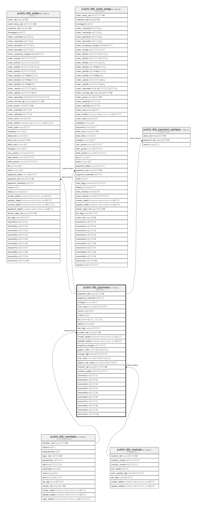

# public.dtb_payment

## Description

支払方法情報

## Columns

| Name | Type | Default | Nullable | Children | Parents | Comment |
| ---- | ---- | ------- | -------- | -------- | ------- | ------- |
| payment_id | integer |  | false | [public.dtb_order](public.dtb_order.md) [public.dtb_order_temp](public.dtb_order_temp.md) [public.dtb_payment_options](public.dtb_payment_options.md) |  | 支払方法ID |
| payment_method | text |  | true |  |  | 支払方法 |
| charge | numeric |  | true |  |  | 手数料 |
| rule_max | numeric |  | true |  |  | 利用条件(円以上) |
| rank | integer |  | true |  |  | 表示順 |
| note | text |  | true |  |  | 備考 |
| fix | smallint |  | true |  |  | 固定:1　自由設定:2 |
| status | smallint | 1 | false |  |  | 状態 |
| del_flg | smallint | 0 | false |  |  | 削除フラグ |
| creator_id | integer |  | false |  | [public.dtb_member](public.dtb_member.md) | 作成者ID |
| create_date | timestamp without time zone | CURRENT_TIMESTAMP | false |  |  | 作成日時 |
| update_date | timestamp without time zone |  | false |  |  | 更新日時 |
| payment_image | text |  | true |  |  | 支払方法ロゴ |
| upper_rule | numeric |  | true |  |  | 利用条件(円以下) |
| charge_flg | smallint | 1 | true |  |  | 手数料設定フラグ |
| rule_min | numeric |  | true |  |  | 利用条件(円以上)の下限 |
| upper_rule_max | numeric |  | true |  |  | 利用条件(円以下)の上限 |
| module_id | integer |  | true |  | [public.dtb_module](public.dtb_module.md) | 追加モジュールID |
| module_path | text |  | true |  |  | 追加モジュールパス |
| memo01 | text |  | true |  |  | 汎用項目1 |
| memo02 | text |  | true |  |  | 汎用項目2 |
| memo03 | text |  | true |  |  | 汎用項目3 |
| memo04 | text |  | true |  |  | 汎用項目4 |
| memo05 | text |  | true |  |  | 汎用項目5 |
| memo06 | text |  | true |  |  | 汎用項目6 |
| memo07 | text |  | true |  |  | 汎用項目7 |
| memo08 | text |  | true |  |  | 汎用項目8 |
| memo09 | text |  | true |  |  | 汎用項目9 |
| memo10 | text |  | true |  |  | 汎用項目10 |

## Constraints

| Name | Type | Definition |
| ---- | ---- | ---------- |
| dtb_payment_pkey | PRIMARY KEY | PRIMARY KEY (payment_id) |

## Indexes

| Name | Definition |
| ---- | ---------- |
| dtb_payment_pkey | CREATE UNIQUE INDEX dtb_payment_pkey ON public.dtb_payment USING btree (payment_id) |

## Relations

---

> Generated by [tbls](https://github.com/k1LoW/tbls)
