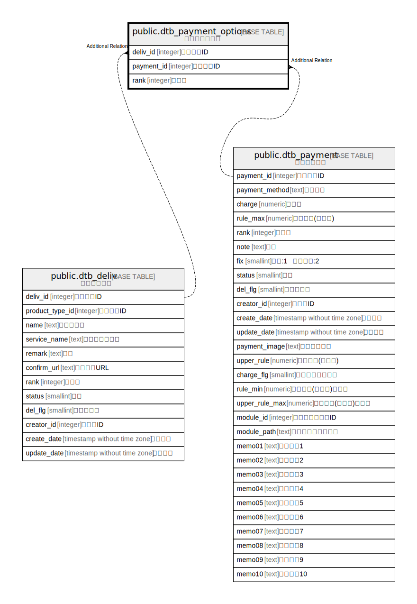

# public.dtb_payment_options

## Description

支払選択肢情報

## Columns

| Name | Type | Default | Nullable | Children | Parents | Comment |
| ---- | ---- | ------- | -------- | -------- | ------- | ------- |
| deliv_id | integer |  | false |  | [public.dtb_deliv](public.dtb_deliv.md) | 配送業者ID |
| payment_id | integer |  | false |  | [public.dtb_payment](public.dtb_payment.md) | 支払方法ID |
| rank | integer |  | true |  |  | 表示順 |

## Constraints

| Name | Type | Definition |
| ---- | ---- | ---------- |
| dtb_payment_options_pkey | PRIMARY KEY | PRIMARY KEY (deliv_id, payment_id) |

## Indexes

| Name | Definition |
| ---- | ---------- |
| dtb_payment_options_pkey | CREATE UNIQUE INDEX dtb_payment_options_pkey ON public.dtb_payment_options USING btree (deliv_id, payment_id) |

## Relations

---

> Generated by [tbls](https://github.com/k1LoW/tbls)
