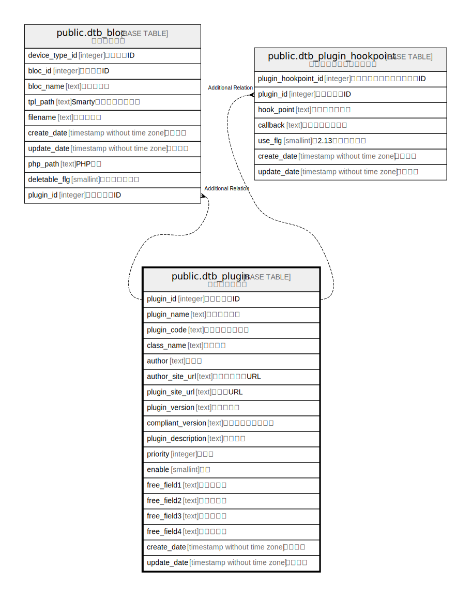

# public.dtb_plugin

## Description

プラグイン情報

## Columns

| Name | Type | Default | Nullable | Children | Parents | Comment |
| ---- | ---- | ------- | -------- | -------- | ------- | ------- |
| plugin_id | integer |  | false | [public.dtb_bloc](public.dtb_bloc.md) [public.dtb_plugin_hookpoint](public.dtb_plugin_hookpoint.md) |  | プラグインID |
| plugin_name | text |  | false |  |  | プラグイン名 |
| plugin_code | text |  | false |  |  | プラグインコード |
| class_name | text |  | false |  |  | クラス名 |
| author | text |  | true |  |  | 作成者 |
| author_site_url | text |  | true |  |  | 作成者サイトURL |
| plugin_site_url | text |  | true |  |  | サイトURL |
| plugin_version | text |  | true |  |  | バージョン |
| compliant_version | text |  | true |  |  | 本体対応バージョン |
| plugin_description | text |  | true |  |  | 詳細説明 |
| priority | integer | 0 | false |  |  | 優先度 |
| enable | smallint | 0 | false |  |  | 有効 |
| free_field1 | text |  | true |  |  | 任意項目１ |
| free_field2 | text |  | true |  |  | 任意項目２ |
| free_field3 | text |  | true |  |  | 任意項目３ |
| free_field4 | text |  | true |  |  | 任意項目４ |
| create_date | timestamp without time zone | CURRENT_TIMESTAMP | false |  |  | 作成日時 |
| update_date | timestamp without time zone |  | false |  |  | 更新日時 |

## Constraints

| Name | Type | Definition |
| ---- | ---- | ---------- |
| dtb_plugin_pkey | PRIMARY KEY | PRIMARY KEY (plugin_id) |

## Indexes

| Name | Definition |
| ---- | ---------- |
| dtb_plugin_pkey | CREATE UNIQUE INDEX dtb_plugin_pkey ON public.dtb_plugin USING btree (plugin_id) |

## Relations

---

> Generated by [tbls](https://github.com/k1LoW/tbls)
