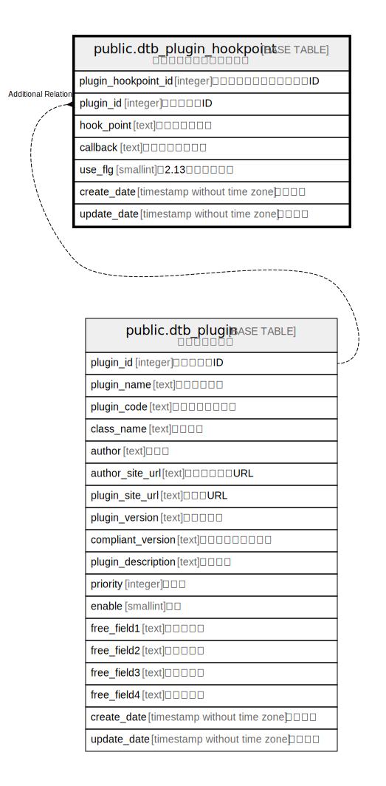

# public.dtb_plugin_hookpoint

## Description

プラグインフックポイント

## Columns

| Name | Type | Default | Nullable | Children | Parents | Comment |
| ---- | ---- | ------- | -------- | -------- | ------- | ------- |
| plugin_hookpoint_id | integer |  | false |  |  | プラグインフックポイントID |
| plugin_id | integer |  | false |  | [public.dtb_plugin](public.dtb_plugin.md) | プラグインID |
| hook_point | text |  | false |  |  | フックポイント |
| callback | text |  | true |  |  | コールバック関数 |
| use_flg | smallint | 1 | false |  |  | 【2.13】利用フラグ |
| create_date | timestamp without time zone | CURRENT_TIMESTAMP | false |  |  | 作成日時 |
| update_date | timestamp without time zone |  | false |  |  | 更新日時 |

## Constraints

| Name | Type | Definition |
| ---- | ---- | ---------- |
| dtb_plugin_hookpoint_pkey | PRIMARY KEY | PRIMARY KEY (plugin_hookpoint_id) |

## Indexes

| Name | Definition |
| ---- | ---------- |
| dtb_plugin_hookpoint_pkey | CREATE UNIQUE INDEX dtb_plugin_hookpoint_pkey ON public.dtb_plugin_hookpoint USING btree (plugin_hookpoint_id) |

## Relations

---

> Generated by [tbls](https://github.com/k1LoW/tbls)
