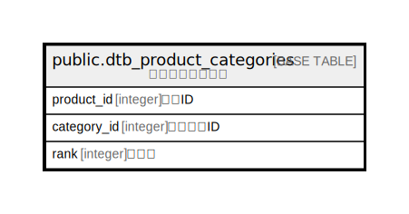

# public.dtb_product_categories

## Description

商品カテゴリ関連

## Columns

| Name | Type | Default | Nullable | Children | Parents | Comment |
| ---- | ---- | ------- | -------- | -------- | ------- | ------- |
| product_id | integer |  | false |  | [public.dtb_products](public.dtb_products.md) | 商品ID |
| category_id | integer |  | false |  | [public.dtb_category](public.dtb_category.md) | カテゴリID |
| rank | integer |  | false |  |  | 表示順 |

## Constraints

| Name | Type | Definition |
| ---- | ---- | ---------- |
| dtb_product_categories_pkey | PRIMARY KEY | PRIMARY KEY (product_id, category_id) |

## Indexes

| Name | Definition |
| ---- | ---------- |
| dtb_product_categories_pkey | CREATE UNIQUE INDEX dtb_product_categories_pkey ON public.dtb_product_categories USING btree (product_id, category_id) |

## Relations

---

> Generated by [tbls](https://github.com/k1LoW/tbls)
