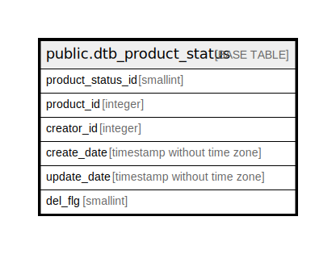

# public.dtb_product_status

## Description

商品ステータス情報

## Columns

| Name | Type | Default | Nullable | Children | Parents | Comment |
| ---- | ---- | ------- | -------- | -------- | ------- | ------- |
| product_status_id | smallint |  | false |  | [public.mtb_status](public.mtb_status.md) [public.mtb_status_image](public.mtb_status_image.md) | 商品ステータスID |
| product_id | integer |  | false |  | [public.dtb_products](public.dtb_products.md) | 商品ID |
| creator_id | integer |  | false |  | [public.dtb_member](public.dtb_member.md) | 作成者ID |
| create_date | timestamp without time zone | CURRENT_TIMESTAMP | false |  |  | 作成日時 |
| update_date | timestamp without time zone |  | false |  |  | 更新日時 |
| del_flg | smallint | 0 | false |  |  | 削除フラグ |

## Constraints

| Name | Type | Definition |
| ---- | ---- | ---------- |
| dtb_product_status_pkey | PRIMARY KEY | PRIMARY KEY (product_status_id, product_id) |

## Indexes

| Name | Definition |
| ---- | ---------- |
| dtb_product_status_pkey | CREATE UNIQUE INDEX dtb_product_status_pkey ON public.dtb_product_status USING btree (product_status_id, product_id) |

## Relations

---

> Generated by [tbls](https://github.com/k1LoW/tbls)
