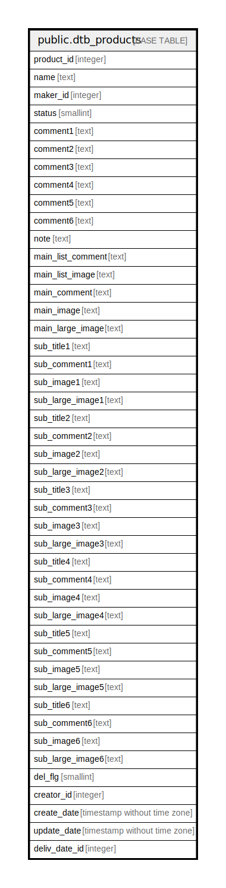

# public.dtb_products

## Description

商品情報

## Columns

| Name | Type | Default | Nullable | Children | Parents | Comment |
| ---- | ---- | ------- | -------- | -------- | ------- | ------- |
| product_id | integer |  | false | [public.dtb_products_class](public.dtb_products_class.md) [public.dtb_product_status](public.dtb_product_status.md) [public.dtb_product_categories](public.dtb_product_categories.md) [public.dtb_recommend_products](public.dtb_recommend_products.md) [public.dtb_best_products](public.dtb_best_products.md) [public.dtb_review](public.dtb_review.md) [public.dtb_customer_favorite_products](public.dtb_customer_favorite_products.md) [public.dtb_order_detail](public.dtb_order_detail.md) [public.dtb_tax_rule](public.dtb_tax_rule.md) |  | 商品ID |
| name | text |  | false |  |  | 商品名 |
| maker_id | integer |  | true |  | [public.dtb_maker](public.dtb_maker.md) | メーカーID |
| status | smallint | 2 | false |  | [public.mtb_disp](public.mtb_disp.md) | 表示ステータス |
| comment1 | text |  | true |  |  | コメント1(メーカーURL) |
| comment2 | text |  | true |  |  | コメント2 |
| comment3 | text |  | true |  |  | コメント3(検索ワード) |
| comment4 | text |  | true |  |  | コメント4 |
| comment5 | text |  | true |  |  | コメント5 |
| comment6 | text |  | true |  |  | コメント6 |
| note | text |  | true |  |  | 備考 |
| main_list_comment | text |  | true |  |  | メイン一覧コメント |
| main_list_image | text |  | true |  |  | メイン一覧画像 |
| main_comment | text |  | true |  |  | メインコメント |
| main_image | text |  | true |  |  | メイン画像 |
| main_large_image | text |  | true |  |  | メイン拡大画像 |
| sub_title1 | text |  | true |  |  | サブタイトル1 |
| sub_comment1 | text |  | true |  |  | サブコメント1 |
| sub_image1 | text |  | true |  |  | サブ画像1 |
| sub_large_image1 | text |  | true |  |  | サブ拡大画像1 |
| sub_title2 | text |  | true |  |  | サブタイトル2 |
| sub_comment2 | text |  | true |  |  | サブコメント2 |
| sub_image2 | text |  | true |  |  | サブ画像2 |
| sub_large_image2 | text |  | true |  |  | サブ拡大画像2 |
| sub_title3 | text |  | true |  |  | サブタイトル3 |
| sub_comment3 | text |  | true |  |  | サブコメント3 |
| sub_image3 | text |  | true |  |  | サブ画像3 |
| sub_large_image3 | text |  | true |  |  | サブ拡大画像3 |
| sub_title4 | text |  | true |  |  | サブタイトル4 |
| sub_comment4 | text |  | true |  |  | サブコメント4 |
| sub_image4 | text |  | true |  |  | サブ画像4 |
| sub_large_image4 | text |  | true |  |  | サブ拡大画像4 |
| sub_title5 | text |  | true |  |  | サブタイトル5 |
| sub_comment5 | text |  | true |  |  | サブコメント5 |
| sub_image5 | text |  | true |  |  | サブ画像5 |
| sub_large_image5 | text |  | true |  |  | サブ拡大画像5 |
| sub_title6 | text |  | true |  |  | サブタイトル6 |
| sub_comment6 | text |  | true |  |  | サブコメント6 |
| sub_image6 | text |  | true |  |  | サブ画像6 |
| sub_large_image6 | text |  | true |  |  | サブ拡大画像6 |
| del_flg | smallint | 0 | false |  |  | 削除フラグ |
| creator_id | integer |  | false |  | [public.dtb_member](public.dtb_member.md) | 作成者ID |
| create_date | timestamp without time zone | CURRENT_TIMESTAMP | false |  |  | 作成日時 |
| update_date | timestamp without time zone |  | false |  |  | 更新日時 |
| deliv_date_id | integer |  | true |  | [public.mtb_delivery_date](public.mtb_delivery_date.md) | 発送日目安 |

## Constraints

| Name | Type | Definition |
| ---- | ---- | ---------- |
| dtb_products_pkey | PRIMARY KEY | PRIMARY KEY (product_id) |

## Indexes

| Name | Definition |
| ---- | ---------- |
| dtb_products_pkey | CREATE UNIQUE INDEX dtb_products_pkey ON public.dtb_products USING btree (product_id) |

## Relations

---

> Generated by [tbls](https://github.com/k1LoW/tbls)
