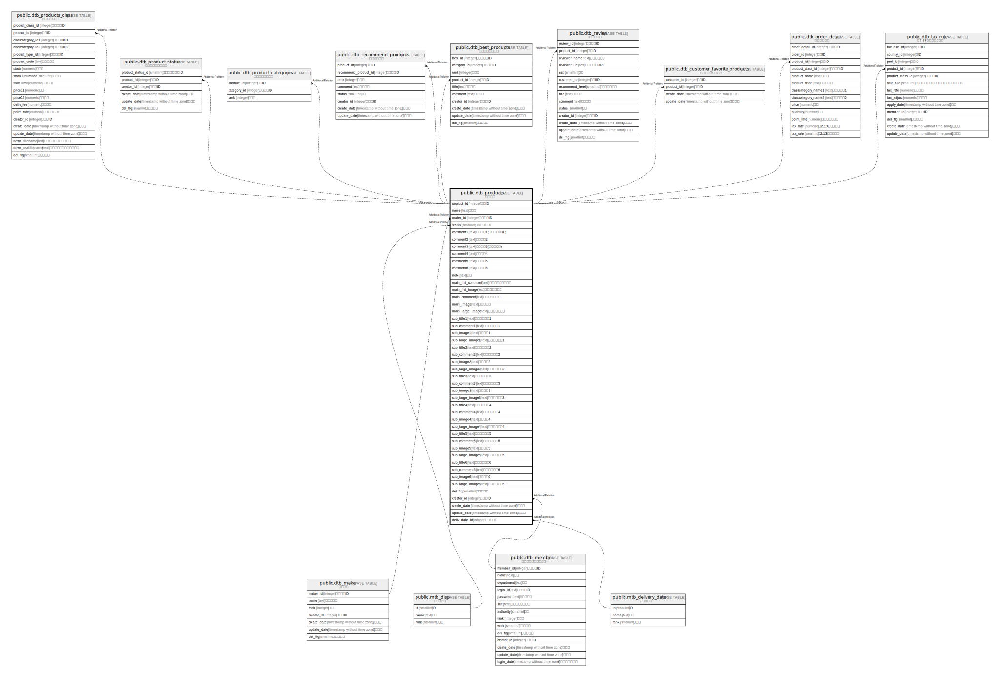

# public.dtb_products

## Description

## Columns

| Name | Type | Default | Nullable | Children | Parents | Comment |
| ---- | ---- | ------- | -------- | -------- | ------- | ------- |
| product_id | integer |  | false |  |  |  |
| name | text |  | false |  |  |  |
| maker_id | integer |  | true |  |  |  |
| status | smallint | 2 | false |  |  |  |
| comment1 | text |  | true |  |  |  |
| comment2 | text |  | true |  |  |  |
| comment3 | text |  | true |  |  |  |
| comment4 | text |  | true |  |  |  |
| comment5 | text |  | true |  |  |  |
| comment6 | text |  | true |  |  |  |
| note | text |  | true |  |  |  |
| main_list_comment | text |  | true |  |  |  |
| main_list_image | text |  | true |  |  |  |
| main_comment | text |  | true |  |  |  |
| main_image | text |  | true |  |  |  |
| main_large_image | text |  | true |  |  |  |
| sub_title1 | text |  | true |  |  |  |
| sub_comment1 | text |  | true |  |  |  |
| sub_image1 | text |  | true |  |  |  |
| sub_large_image1 | text |  | true |  |  |  |
| sub_title2 | text |  | true |  |  |  |
| sub_comment2 | text |  | true |  |  |  |
| sub_image2 | text |  | true |  |  |  |
| sub_large_image2 | text |  | true |  |  |  |
| sub_title3 | text |  | true |  |  |  |
| sub_comment3 | text |  | true |  |  |  |
| sub_image3 | text |  | true |  |  |  |
| sub_large_image3 | text |  | true |  |  |  |
| sub_title4 | text |  | true |  |  |  |
| sub_comment4 | text |  | true |  |  |  |
| sub_image4 | text |  | true |  |  |  |
| sub_large_image4 | text |  | true |  |  |  |
| sub_title5 | text |  | true |  |  |  |
| sub_comment5 | text |  | true |  |  |  |
| sub_image5 | text |  | true |  |  |  |
| sub_large_image5 | text |  | true |  |  |  |
| sub_title6 | text |  | true |  |  |  |
| sub_comment6 | text |  | true |  |  |  |
| sub_image6 | text |  | true |  |  |  |
| sub_large_image6 | text |  | true |  |  |  |
| del_flg | smallint | 0 | false |  |  |  |
| creator_id | integer |  | false |  |  |  |
| create_date | timestamp without time zone | CURRENT_TIMESTAMP | false |  |  |  |
| update_date | timestamp without time zone |  | false |  |  |  |
| deliv_date_id | integer |  | true |  |  |  |

## Constraints

| Name | Type | Definition |
| ---- | ---- | ---------- |
| dtb_products_pkey | PRIMARY KEY | PRIMARY KEY (product_id) |

## Indexes

| Name | Definition |
| ---- | ---------- |
| dtb_products_pkey | CREATE UNIQUE INDEX dtb_products_pkey ON public.dtb_products USING btree (product_id) |

## Relations

---

> Generated by [tbls](https://github.com/k1LoW/tbls)
