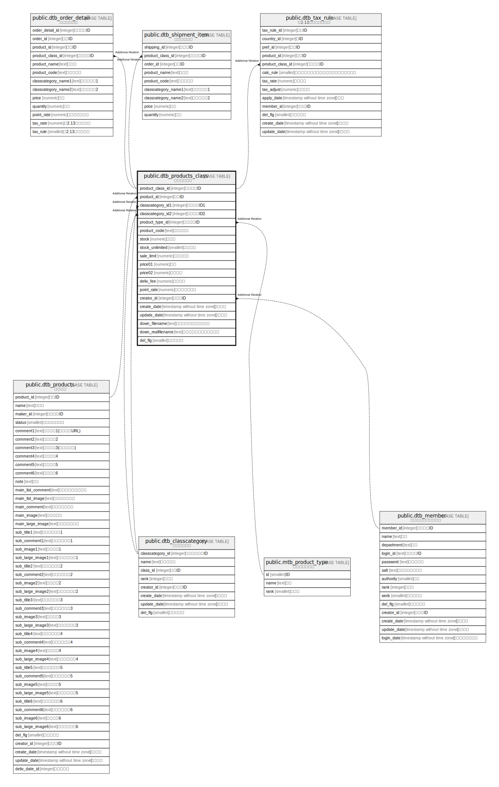

# public.dtb_products_class

## Description

## Columns

| Name | Type | Default | Nullable | Children | Parents | Comment |
| ---- | ---- | ------- | -------- | -------- | ------- | ------- |
| product_class_id | integer |  | false |  |  |  |
| product_id | integer |  | false |  |  |  |
| classcategory_id1 | integer | 0 | false |  |  |  |
| classcategory_id2 | integer | 0 | false |  |  |  |
| product_type_id | integer | 0 | false |  |  |  |
| product_code | text |  | true |  |  |  |
| stock | numeric |  | true |  |  |  |
| stock_unlimited | smallint | 0 | false |  |  |  |
| sale_limit | numeric |  | true |  |  |  |
| price01 | numeric |  | true |  |  |  |
| price02 | numeric |  | false |  |  |  |
| deliv_fee | numeric |  | true |  |  |  |
| point_rate | numeric | 0 | false |  |  |  |
| creator_id | integer |  | false |  |  |  |
| create_date | timestamp without time zone | CURRENT_TIMESTAMP | false |  |  |  |
| update_date | timestamp without time zone |  | false |  |  |  |
| down_filename | text |  | true |  |  |  |
| down_realfilename | text |  | true |  |  |  |
| del_flg | smallint | 0 | false |  |  |  |

## Constraints

| Name | Type | Definition |
| ---- | ---- | ---------- |
| dtb_products_class_pkey | PRIMARY KEY | PRIMARY KEY (product_class_id) |
| dtb_products_class_unique_key | UNIQUE | UNIQUE (product_id, classcategory_id1, classcategory_id2) |

## Indexes

| Name | Definition |
| ---- | ---------- |
| dtb_products_class_pkey | CREATE UNIQUE INDEX dtb_products_class_pkey ON public.dtb_products_class USING btree (product_class_id) |
| dtb_products_class_unique_key | CREATE UNIQUE INDEX dtb_products_class_unique_key ON public.dtb_products_class USING btree (product_id, classcategory_id1, classcategory_id2) |
| dtb_products_class_product_id_key | CREATE INDEX dtb_products_class_product_id_key ON public.dtb_products_class USING btree (product_id) WHERE (del_flg = 0) |
| dtb_products_class_product_code_key | CREATE INDEX dtb_products_class_product_code_key ON public.dtb_products_class USING btree (product_id, product_code) WHERE (del_flg = 0) |
| dtb_products_class_price01_key | CREATE INDEX dtb_products_class_price01_key ON public.dtb_products_class USING btree (product_id, price01) WHERE (del_flg = 0) |
| dtb_products_class_price02_key | CREATE INDEX dtb_products_class_price02_key ON public.dtb_products_class USING btree (product_id, price02) WHERE (del_flg = 0) |
| dtb_products_class_stock_key | CREATE INDEX dtb_products_class_stock_key ON public.dtb_products_class USING btree (product_id, stock) WHERE (del_flg = 0) |
| dtb_products_class_stock_unlimited_key | CREATE INDEX dtb_products_class_stock_unlimited_key ON public.dtb_products_class USING btree (product_id, stock_unlimited) WHERE (del_flg = 0) |
| dtb_products_class_point_rate_key | CREATE INDEX dtb_products_class_point_rate_key ON public.dtb_products_class USING btree (product_id, point_rate) WHERE (del_flg = 0) |
| dtb_products_class_deliv_fee_key | CREATE INDEX dtb_products_class_deliv_fee_key ON public.dtb_products_class USING btree (product_id, deliv_fee) WHERE (del_flg = 0) |

## Relations

---

> Generated by [tbls](https://github.com/k1LoW/tbls)
