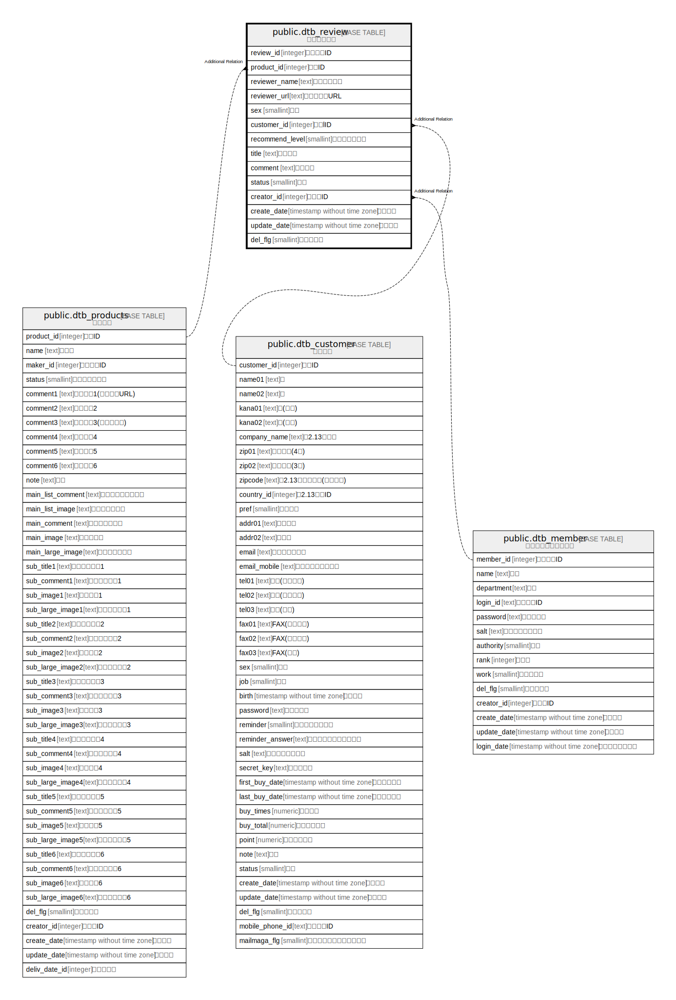

# public.dtb_review

## Description

## Columns

| Name | Type | Default | Nullable | Children | Parents | Comment |
| ---- | ---- | ------- | -------- | -------- | ------- | ------- |
| review_id | integer |  | false |  |  |  |
| product_id | integer |  | false |  |  |  |
| reviewer_name | text |  | false |  |  |  |
| reviewer_url | text |  | true |  |  |  |
| sex | smallint |  | true |  |  |  |
| customer_id | integer |  | true |  |  |  |
| recommend_level | smallint |  | false |  |  |  |
| title | text |  | false |  |  |  |
| comment | text |  | false |  |  |  |
| status | smallint | 2 | true |  |  |  |
| creator_id | integer |  | false |  |  |  |
| create_date | timestamp without time zone | CURRENT_TIMESTAMP | false |  |  |  |
| update_date | timestamp without time zone |  | false |  |  |  |
| del_flg | smallint | 0 | false |  |  |  |

## Constraints

| Name | Type | Definition |
| ---- | ---- | ---------- |
| dtb_review_pkey | PRIMARY KEY | PRIMARY KEY (review_id) |

## Indexes

| Name | Definition |
| ---- | ---------- |
| dtb_review_pkey | CREATE UNIQUE INDEX dtb_review_pkey ON public.dtb_review USING btree (review_id) |

## Relations

---

> Generated by [tbls](https://github.com/k1LoW/tbls)
