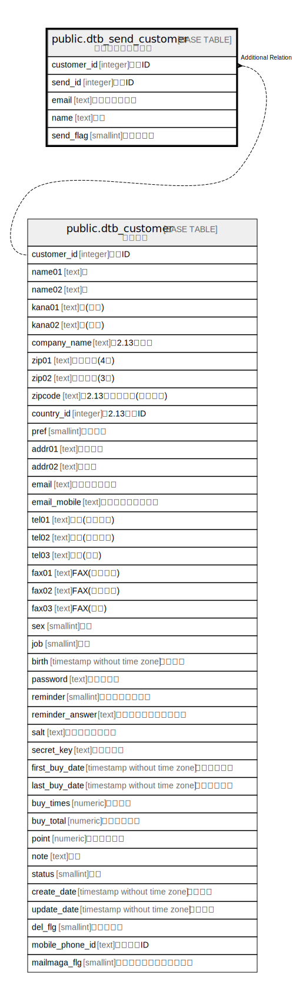

# public.dtb_send_customer

## Description

顧客メール送信履歴

## Columns

| Name | Type | Default | Nullable | Children | Parents | Comment |
| ---- | ---- | ------- | -------- | -------- | ------- | ------- |
| customer_id | integer |  | false |  | [public.dtb_customer](public.dtb_customer.md) | 顧客ID |
| send_id | integer |  | false |  |  | 送信ID |
| email | text |  | true |  |  | メールアドレス |
| name | text |  | true |  |  | 名前 |
| send_flag | smallint |  | true |  |  | 送信フラグ |

## Constraints

| Name | Type | Definition |
| ---- | ---- | ---------- |
| dtb_send_customer_pkey | PRIMARY KEY | PRIMARY KEY (send_id, customer_id) |

## Indexes

| Name | Definition |
| ---- | ---------- |
| dtb_send_customer_pkey | CREATE UNIQUE INDEX dtb_send_customer_pkey ON public.dtb_send_customer USING btree (send_id, customer_id) |
| dtb_send_customer_customer_id_key | CREATE INDEX dtb_send_customer_customer_id_key ON public.dtb_send_customer USING btree (customer_id) |

## Relations

---

> Generated by [tbls](https://github.com/k1LoW/tbls)
