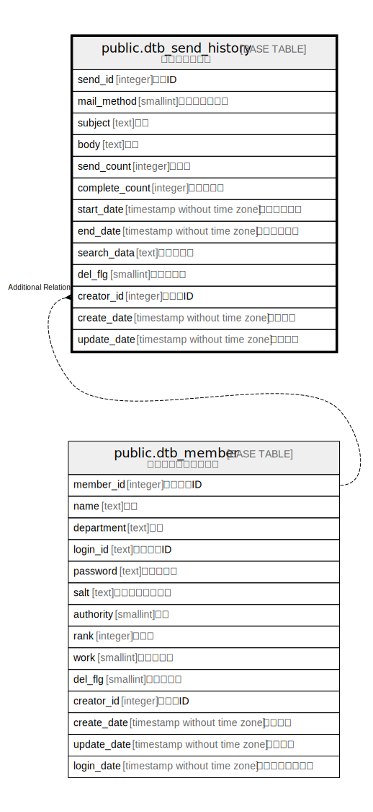

# public.dtb_send_history

## Description

メール送信履歴

## Columns

| Name | Type | Default | Nullable | Children | Parents | Comment |
| ---- | ---- | ------- | -------- | -------- | ------- | ------- |
| send_id | integer |  | false |  |  | 送信ID |
| mail_method | smallint |  | true |  |  | メール送信方法 |
| subject | text |  | true |  |  | 件名 |
| body | text |  | true |  |  | 本文 |
| send_count | integer |  | true |  |  | 送信数 |
| complete_count | integer | 0 | false |  |  | 送信完了数 |
| start_date | timestamp without time zone |  | true |  |  | 送信開始日時 |
| end_date | timestamp without time zone |  | true |  |  | 送信完了日時 |
| search_data | text |  | true |  |  | 検索データ |
| del_flg | smallint | 0 | false |  |  | 削除フラグ |
| creator_id | integer |  | false |  | [public.dtb_member](public.dtb_member.md) | 作成者ID |
| create_date | timestamp without time zone | CURRENT_TIMESTAMP | false |  |  | 作成日時 |
| update_date | timestamp without time zone |  | false |  |  | 更新日時 |

## Constraints

| Name | Type | Definition |
| ---- | ---- | ---------- |
| dtb_send_history_pkey | PRIMARY KEY | PRIMARY KEY (send_id) |

## Indexes

| Name | Definition |
| ---- | ---------- |
| dtb_send_history_pkey | CREATE UNIQUE INDEX dtb_send_history_pkey ON public.dtb_send_history USING btree (send_id) |

## Relations

---

> Generated by [tbls](https://github.com/k1LoW/tbls)
