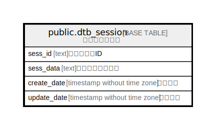

# public.dtb_session

## Description

セッション情報

## Columns

| Name | Type | Default | Nullable | Children | Parents | Comment |
| ---- | ---- | ------- | -------- | -------- | ------- | ------- |
| sess_id | text |  | false |  |  | セッションID |
| sess_data | text |  | true |  |  | セッションデータ |
| create_date | timestamp without time zone | CURRENT_TIMESTAMP | false |  |  | 作成日時 |
| update_date | timestamp without time zone |  | false |  |  | 更新日時 |

## Constraints

| Name | Type | Definition |
| ---- | ---- | ---------- |
| dtb_session_pkey | PRIMARY KEY | PRIMARY KEY (sess_id) |

## Indexes

| Name | Definition |
| ---- | ---------- |
| dtb_session_pkey | CREATE UNIQUE INDEX dtb_session_pkey ON public.dtb_session USING btree (sess_id) |
| dtb_session_update_date_key | CREATE INDEX dtb_session_update_date_key ON public.dtb_session USING btree (update_date) |

## Relations

---

> Generated by [tbls](https://github.com/k1LoW/tbls)
