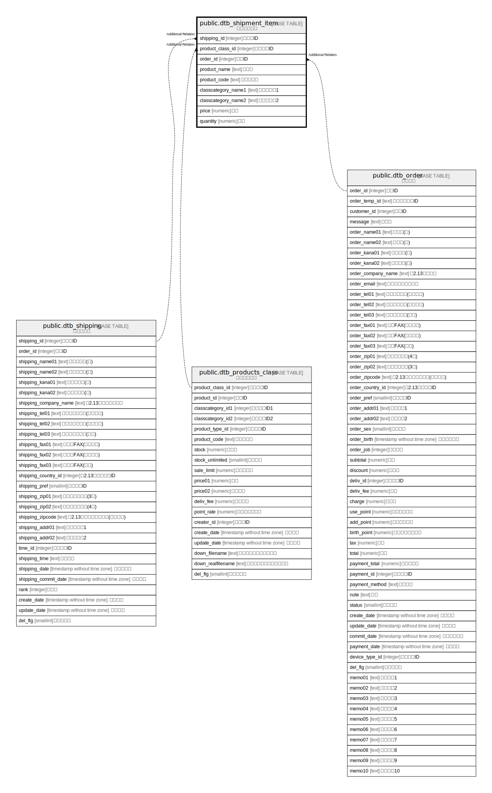

# public.dtb_shipment_item

## Description

配送商品情報

## Columns

| Name | Type | Default | Nullable | Children | Parents | Comment |
| ---- | ---- | ------- | -------- | -------- | ------- | ------- |
| shipping_id | integer |  | false |  |  | 配送先ID |
| product_class_id | integer |  | false |  |  | 商品規格ID |
| order_id | integer |  | false |  |  | 受注ID |
| product_name | text |  | false |  |  | 商品名 |
| product_code | text |  | true |  |  | 商品コード |
| classcategory_name1 | text |  | true |  |  | 商品規格名1 |
| classcategory_name2 | text |  | true |  |  | 商品規格名2 |
| price | numeric |  | true |  |  | 価格 |
| quantity | numeric |  | true |  |  | 個数 |

## Constraints

| Name | Type | Definition |
| ---- | ---- | ---------- |
| dtb_shipment_item_pkey | PRIMARY KEY | PRIMARY KEY (order_id, shipping_id, product_class_id) |

## Indexes

| Name | Definition |
| ---- | ---------- |
| dtb_shipment_item_pkey | CREATE UNIQUE INDEX dtb_shipment_item_pkey ON public.dtb_shipment_item USING btree (order_id, shipping_id, product_class_id) |

## Relations

---

> Generated by [tbls](https://github.com/k1LoW/tbls)
