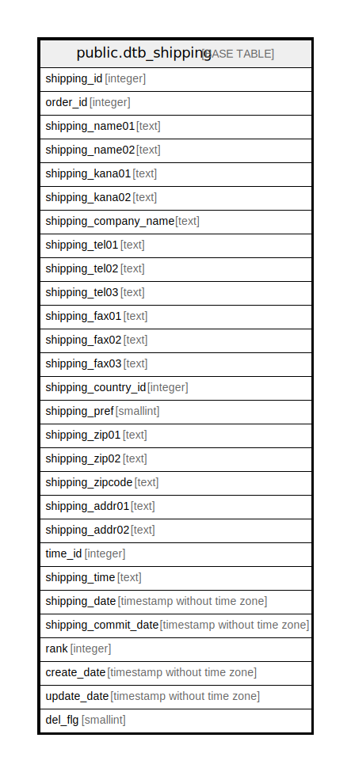

# public.dtb_shipping

## Description

配送先情報

## Columns

| Name | Type | Default | Nullable | Children | Parents | Comment |
| ---- | ---- | ------- | -------- | -------- | ------- | ------- |
| shipping_id | integer |  | false | [public.dtb_shipment_item](public.dtb_shipment_item.md) |  | 配送先ID |
| order_id | integer |  | false |  | [public.dtb_order](public.dtb_order.md) | 受注ID |
| shipping_name01 | text |  | true |  |  | 配送先名前(姓) |
| shipping_name02 | text |  | true |  |  | 配送先名前(名) |
| shipping_kana01 | text |  | true |  |  | 配送先カナ(姓) |
| shipping_kana02 | text |  | true |  |  | 配送先カナ(名) |
| shipping_company_name | text |  | true |  |  | 【2.13】配送先会社名 |
| shipping_tel01 | text |  | true |  |  | 配送先電話番号(市外局番) |
| shipping_tel02 | text |  | true |  |  | 配送先電話番号(市内局番) |
| shipping_tel03 | text |  | true |  |  | 配送先電話番号(局番) |
| shipping_fax01 | text |  | true |  |  | 配送先FAX(市外局番) |
| shipping_fax02 | text |  | true |  |  | 配送先FAX(市内局番) |
| shipping_fax03 | text |  | true |  |  | 配送先FAX(局番) |
| shipping_country_id | integer |  | true |  | [public.mtb_country](public.mtb_country.md) | 【2.13】配送先国ID |
| shipping_pref | smallint |  | true |  | [public.mtb_pref](public.mtb_pref.md) | 都道府県ID |
| shipping_zip01 | text |  | true |  |  | 配送先郵便番号(3桁) |
| shipping_zip02 | text |  | true |  |  | 配送先郵便番号(4桁) |
| shipping_zipcode | text |  | true |  |  | 【2.13】配送先郵便番号(海外対応) |
| shipping_addr01 | text |  | true |  |  | 配送先住所1 |
| shipping_addr02 | text |  | true |  |  | 配送先住所2 |
| time_id | integer |  | true |  | [public.dtb_delivtime](public.dtb_delivtime.md) | 配送時間ID |
| shipping_time | text |  | true |  |  | 配送時間 |
| shipping_date | timestamp without time zone |  | true |  |  | 配達予定日 |
| shipping_commit_date | timestamp without time zone |  | true |  |  | 発送日時 |
| rank | integer |  | true |  |  | 表示順 |
| create_date | timestamp without time zone | CURRENT_TIMESTAMP | false |  |  | 作成日時 |
| update_date | timestamp without time zone |  | false |  |  | 更新日時 |
| del_flg | smallint | 0 | false |  |  | 削除フラグ |

## Constraints

| Name | Type | Definition |
| ---- | ---- | ---------- |
| dtb_shipping_pkey | PRIMARY KEY | PRIMARY KEY (order_id, shipping_id) |

## Indexes

| Name | Definition |
| ---- | ---------- |
| dtb_shipping_pkey | CREATE UNIQUE INDEX dtb_shipping_pkey ON public.dtb_shipping USING btree (order_id, shipping_id) |

## Relations

---

> Generated by [tbls](https://github.com/k1LoW/tbls)
