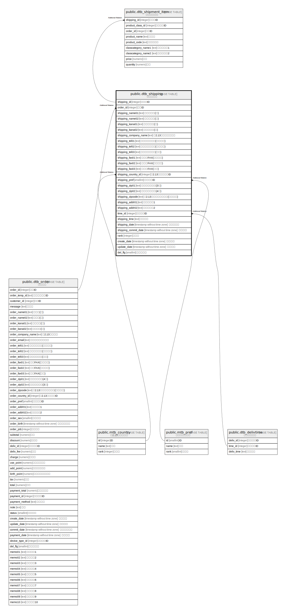

# public.dtb_shipping

## Description

## Columns

| Name | Type | Default | Nullable | Children | Parents | Comment |
| ---- | ---- | ------- | -------- | -------- | ------- | ------- |
| shipping_id | integer |  | false |  |  |  |
| order_id | integer |  | false |  |  |  |
| shipping_name01 | text |  | true |  |  |  |
| shipping_name02 | text |  | true |  |  |  |
| shipping_kana01 | text |  | true |  |  |  |
| shipping_kana02 | text |  | true |  |  |  |
| shipping_company_name | text |  | true |  |  |  |
| shipping_tel01 | text |  | true |  |  |  |
| shipping_tel02 | text |  | true |  |  |  |
| shipping_tel03 | text |  | true |  |  |  |
| shipping_fax01 | text |  | true |  |  |  |
| shipping_fax02 | text |  | true |  |  |  |
| shipping_fax03 | text |  | true |  |  |  |
| shipping_country_id | integer |  | true |  |  |  |
| shipping_pref | smallint |  | true |  |  |  |
| shipping_zip01 | text |  | true |  |  |  |
| shipping_zip02 | text |  | true |  |  |  |
| shipping_zipcode | text |  | true |  |  |  |
| shipping_addr01 | text |  | true |  |  |  |
| shipping_addr02 | text |  | true |  |  |  |
| time_id | integer |  | true |  |  |  |
| shipping_time | text |  | true |  |  |  |
| shipping_date | timestamp without time zone |  | true |  |  |  |
| shipping_commit_date | timestamp without time zone |  | true |  |  |  |
| rank | integer |  | true |  |  |  |
| create_date | timestamp without time zone | CURRENT_TIMESTAMP | false |  |  |  |
| update_date | timestamp without time zone |  | false |  |  |  |
| del_flg | smallint | 0 | false |  |  |  |

## Constraints

| Name | Type | Definition |
| ---- | ---- | ---------- |
| dtb_shipping_pkey | PRIMARY KEY | PRIMARY KEY (order_id, shipping_id) |

## Indexes

| Name | Definition |
| ---- | ---------- |
| dtb_shipping_pkey | CREATE UNIQUE INDEX dtb_shipping_pkey ON public.dtb_shipping USING btree (order_id, shipping_id) |

## Relations

---

> Generated by [tbls](https://github.com/k1LoW/tbls)
