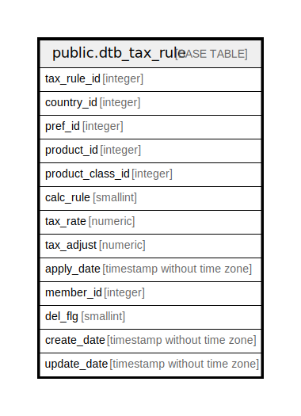

# public.dtb_tax_rule

## Description

【2.13】消費税ルール

## Columns

| Name | Type | Default | Nullable | Children | Parents | Comment |
| ---- | ---- | ------- | -------- | -------- | ------- | ------- |
| tax_rule_id | integer |  | false |  |  | 税率ID |
| country_id | integer | 0 | false |  | [public.mtb_country](public.mtb_country.md) | 国ID |
| pref_id | integer | 0 | false |  | [public.mtb_pref](public.mtb_pref.md) | 地域ID |
| product_id | integer | 0 | false |  | [public.dtb_products](public.dtb_products.md) | 商品ID |
| product_class_id | integer | 0 | false |  | [public.dtb_products_class](public.dtb_products_class.md) | 商品規格ID |
| calc_rule | smallint | 1 | false |  | [public.mtb_taxrule](public.mtb_taxrule.md) | 課税規則（四捨五入、切り上げ、切り捨て） |
| tax_rate | numeric | 8 | false |  |  | 消費税率 |
| tax_adjust | numeric | 0 | false |  |  | 固定金額 |
| apply_date | timestamp without time zone | CURRENT_TIMESTAMP | false |  |  | 適用日 |
| member_id | integer |  | false |  | [public.dtb_member](public.dtb_member.md) | 作成者ID |
| del_flg | smallint | 0 | false |  |  | 削除フラグ |
| create_date | timestamp without time zone |  | false |  |  | 作成日時 |
| update_date | timestamp without time zone |  | false |  |  | 更新日時 |

## Constraints

| Name | Type | Definition |
| ---- | ---- | ---------- |
| dtb_tax_rule_pkey | PRIMARY KEY | PRIMARY KEY (tax_rule_id) |

## Indexes

| Name | Definition |
| ---- | ---------- |
| dtb_tax_rule_pkey | CREATE UNIQUE INDEX dtb_tax_rule_pkey ON public.dtb_tax_rule USING btree (tax_rule_id) |

## Relations

---

> Generated by [tbls](https://github.com/k1LoW/tbls)
