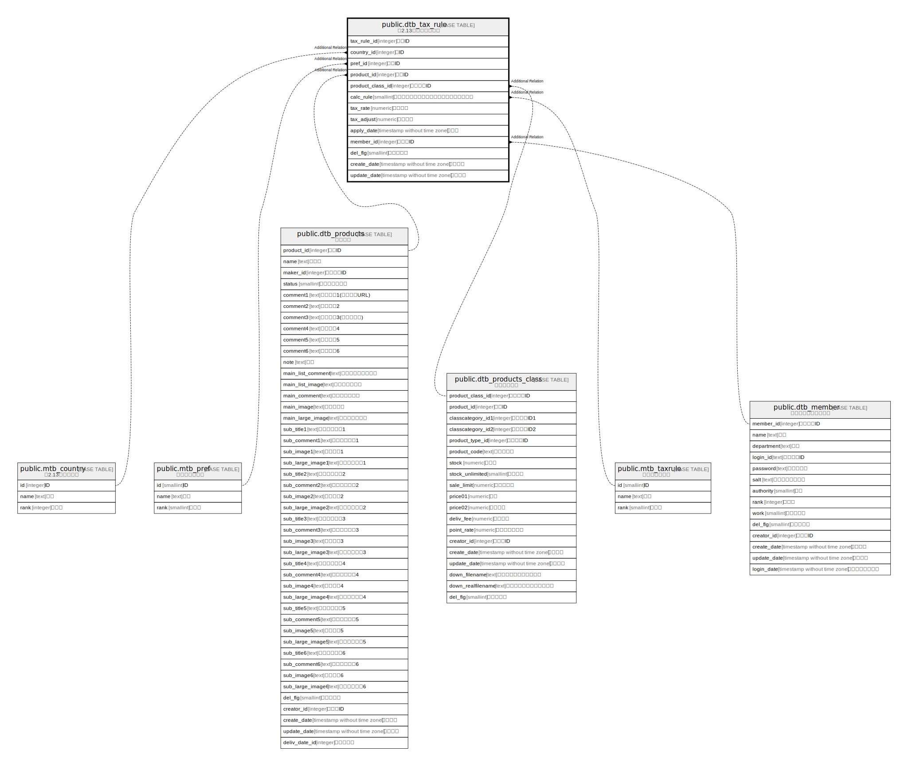

# public.dtb_tax_rule

## Description

## Columns

| Name | Type | Default | Nullable | Children | Parents | Comment |
| ---- | ---- | ------- | -------- | -------- | ------- | ------- |
| tax_rule_id | integer |  | false |  |  |  |
| country_id | integer | 0 | false |  |  |  |
| pref_id | integer | 0 | false |  |  |  |
| product_id | integer | 0 | false |  |  |  |
| product_class_id | integer | 0 | false |  |  |  |
| calc_rule | smallint | 1 | false |  |  |  |
| tax_rate | numeric | 8 | false |  |  |  |
| tax_adjust | numeric | 0 | false |  |  |  |
| apply_date | timestamp without time zone | CURRENT_TIMESTAMP | false |  |  |  |
| member_id | integer |  | false |  |  |  |
| del_flg | smallint | 0 | false |  |  |  |
| create_date | timestamp without time zone |  | false |  |  |  |
| update_date | timestamp without time zone |  | false |  |  |  |

## Constraints

| Name | Type | Definition |
| ---- | ---- | ---------- |
| dtb_tax_rule_pkey | PRIMARY KEY | PRIMARY KEY (tax_rule_id) |

## Indexes

| Name | Definition |
| ---- | ---------- |
| dtb_tax_rule_pkey | CREATE UNIQUE INDEX dtb_tax_rule_pkey ON public.dtb_tax_rule USING btree (tax_rule_id) |

## Relations

---

> Generated by [tbls](https://github.com/k1LoW/tbls)
